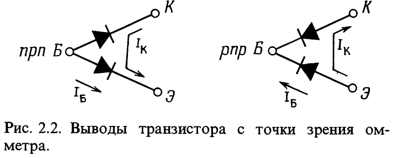
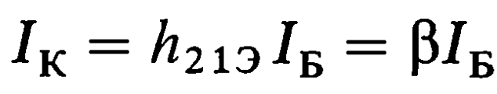
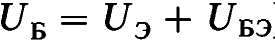
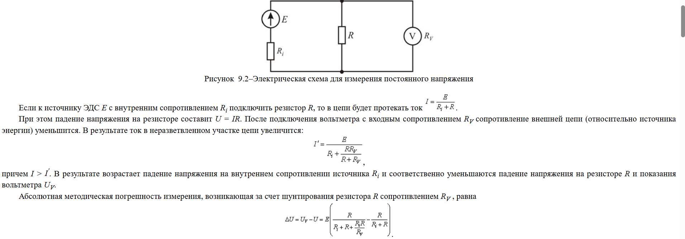

# Транзистор

## Введение.

    Транзистор является полупроводниковым прибором, который может усиливать входной сигнал по мощности. Увеличение мощности сигнала происходит благодаря внешему источнику питания.

    Напряжение на выводе транзистора, взятое по отношению к земле, обозначается буквенным индексом (К, Б, Э). Напряжение между выводами обозначается двойным индекосом. Если индекс обозначен двумя одинаковыми буквами, это это напряжение источника питания.

## Усилитель тока.

Есть несколько правил, которым подчиняются транзисторы.

1. Коллектор имеет более положительный потенциал по сравнению с эмиттером.

2. Цепи база-эмиттер и база-коллектор работают как диоды.
   
   

3. У каждого транзистора есть свои определенные характеристики. Из-за превышение некоторых из них транзистор выходит из строя.

4. Работает следующее соотношение:
   
   

Основываясь на правиле 2 можно сделать вывод, что работает  следующее соотношение:

## Эмиттерный повторитель.

    Выходной сигнал повторяет входной, но уровень его напряжения на 0.6-0.7В ниже.

     Эмиттерный повторитель обеспечивает усиление ТОЛЬКО по току и мощности.

    Т.к. входной импеданс значительно больше чем выходной, то источник сигнала будет отдавать меньшую мощность, если подключить к нему нагрузку через эмиттерный повторитель. Как именно это работает?

Е у нас источник сигнала 12В. R - сопротивление эмиттерного повторителя, r - внутреннее сопротивление источника. Если R большое, то на нем упадет большее напряжение, соответственно сигнал ослабится меньше. По сути *эмиттерный повторитель понижает выходное сопротивление источника сигнала*.

## Почему у вольтметра должно быть большое сопротивление?

