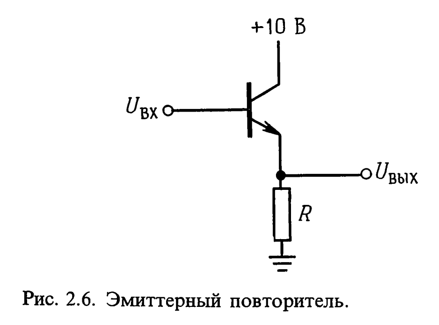

# Транзистор

## Введение.

    Транзистор является полупроводниковым прибором, который может усиливать входной сигнал по мощности. Увеличение мощности сигнала происходит благодаря внешему источнику питания.

    Напряжение на выводе транзистора, взятое по отношению к земле, обозначается буквенным индексом (К, Б, Э). Напряжение между выводами обозначается двойным индекосом. Если индекс обозначен двумя одинаковыми буквами, это это напряжение источника питания.

## Принцип действия транзистора

Рассмотрим схему включения транзистора с общей базой.

    При замыкании ключа эмиттерный переход смещен в прямом направлении, его сопротивление низкое. Дырки, которые посредством диффузии хлынули из эмиттера в базу, не успевают прорекомбинировать в базе и попадают в коллекторный переход. Там они подхватываются электрическим полем и их без потерь выносит в коллектор.  Не успевают прорекомбинировать дырки в базе потому, что база очень тонкая (мкм и меньше).

## Усилитель тока.

Есть несколько правил, которым подчиняются транзисторы.

1. Коллектор имеет более положительный потенциал по сравнению с эмиттером.

2. Цепи база-эмиттер и база-коллектор работают как диоды.
   
   

3. У каждого транзистора есть свои определенные характеристики. Из-за превышение некоторых из них транзистор выходит из строя.

4. Работает следующее соотношение:
   
   

    Основываясь на правиле 2 можно сделать вывод, что работает  следующее соотношение:

## Усилитель напряжения.

    Хоть биполярный транзистор работает как устройство, усиливающее ток, но основное применение он находит в усилителях напряжения. На рисунке ниже показан самый простой ксилитель напряжения. Выходное напряжение возникает в результате протекания коллекторного тока по нагрузке.

## Рабочая точка и смещение.

    Схема выше является сильно упрощенной схемой усилителя. Она будет давать отклик только на положительное входное напряжение, большее чем 0,5 В. Последнее значение является той ЭДС, которая необходима для смещения перехода база-эмиттер в прямом направлении.

    Очевидно, что если нам необходимо усиливать малые сигналы без искажения, то эмиттерный переход должен быть смещен в прямом направлении даже в отсутствии сигнала. При отрицательном входном напряжении выходное напряжение должно двигаться к напряжению источника питания, при положительном наоборот - к напряжению земляной шины.

    На рисунке выше показана схема, в которой достигается требуемый результат.

    Разделительные конденсаторы используются для изоляции внешних цепей от постоянных напряжений, имеющихся нна базе и коллекторе в режиме покоя.

    Серьезный недостаток схемы выше состоит в том, что напряжение коллектора целиком зависит от коэффициента усиления, который может плавать от температуры или иметь большой разброс у экземпляров одного типа.

    На рисунке выше этот недостаток исправлен. Теперь ток базы в режиме покоя зависит от напряжения на коллекторе в режиме покоя. В этой схеме положение рабочей точки хоть и меняется, это не существенно, пока для получения больших сигналов не требуется иметь большие приделы изменения входного напряжения.

    Если схема должна практически независить от коэффициента усиления, то можно использовать схему стабилизированного усилителя.

    Здесь мы добавили резистор R3 и делитель напряжения в цепь базы. Теперь потенциал эмиттера больше не равен потенциалу земли, а ниже потенциала базы на 0.6 В. Делитель же фиксирует потенциал базы на определенном уровне.

Конденсатор большой емкости С3 шунтирует резистор для того чтобы на эммитере не появилось переменное напряжение. Без этого конденсатора усиление напряжения очень сильно упадет из-за ООС, поскольку переменное напряжение на резисторе R3  вычитается из входного сигнала.

## Насыщение.

    В этот pежим биполярный транзистор входит при увеличении тока базы до некоего предельного значения, при кoтoрoм p-n-переходы полностью открываются. Значение тока, протекающего через транзистор при его насыщении, зависит лишь от питающего напряжения и величины нагрузки в коллекторной цепи. В данном режиме входной сигнал не усиливается, ведь коллекторный ток не воспринимает изменений тока базы. 

## Эмиттерный повторитель.

    Выходной сигнал повторяет входной, но уровень его напряжения на 0.6-0.7В ниже.

     Эмиттерный повторитель обеспечивает усиление ТОЛЬКО по току и мощности.

    Т.к. входной импеданс значительно больше чем выходной, то источник сигнала будет отдавать меньшую мощность, если подключить к нему нагрузку через эмиттерный повторитель. Как именно это работает?

Е у нас источник сигнала 12В. R - сопротивление эмиттерного повторителя, r - внутреннее сопротивление источника. Если R большое, то на нем упадет большее напряжение, соответственно сигнал ослабится меньше. По сути *эмиттерный повторитель понижает выходное сопротивление источника сигнала*.

## Почему у вольтметра должно быть большое сопротивление?

