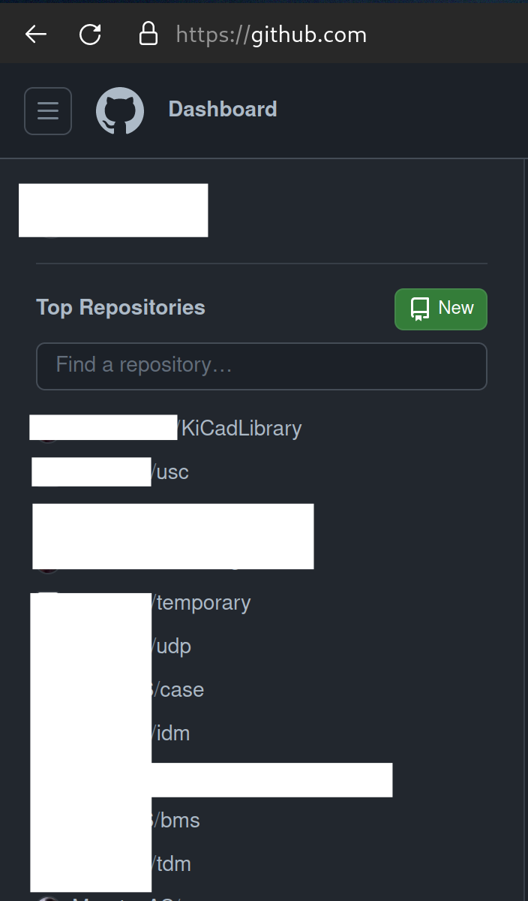
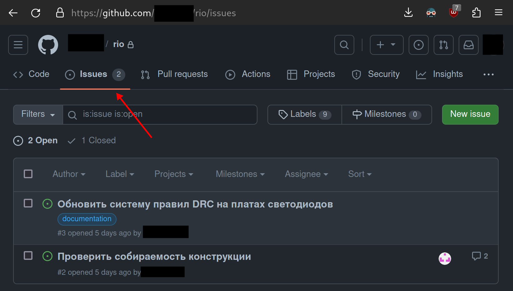
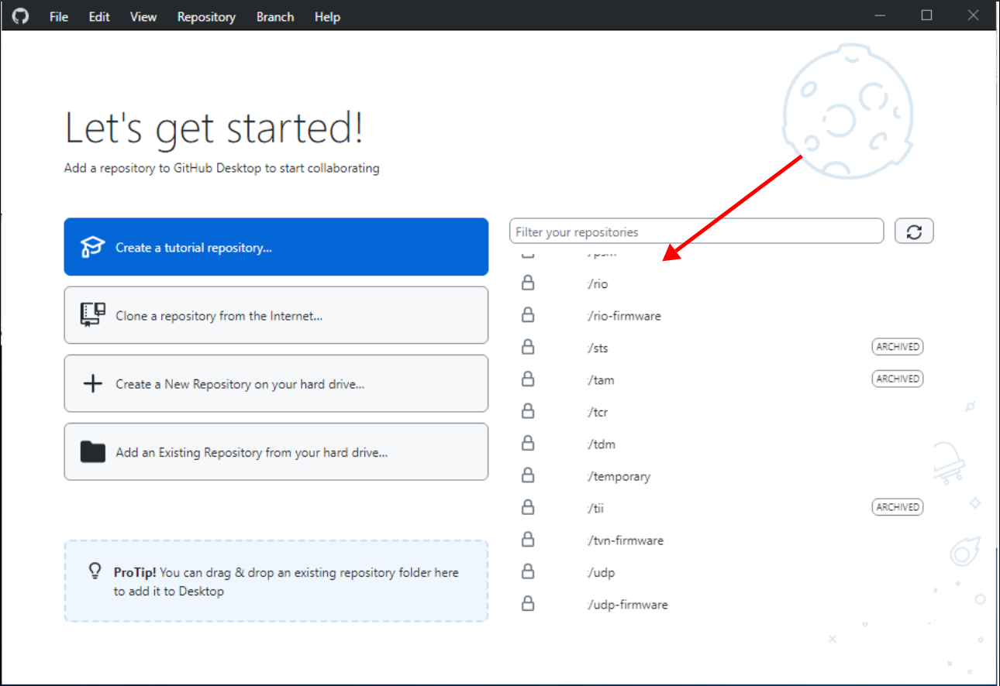
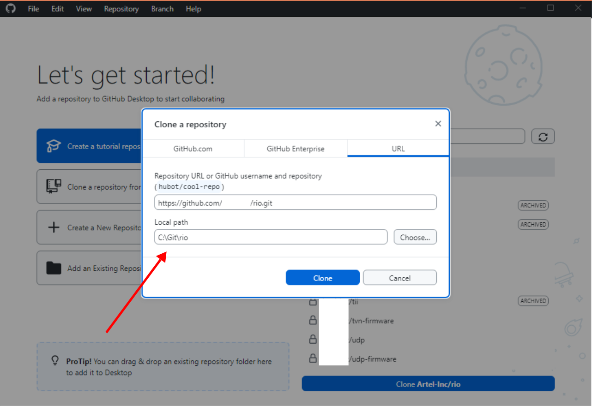
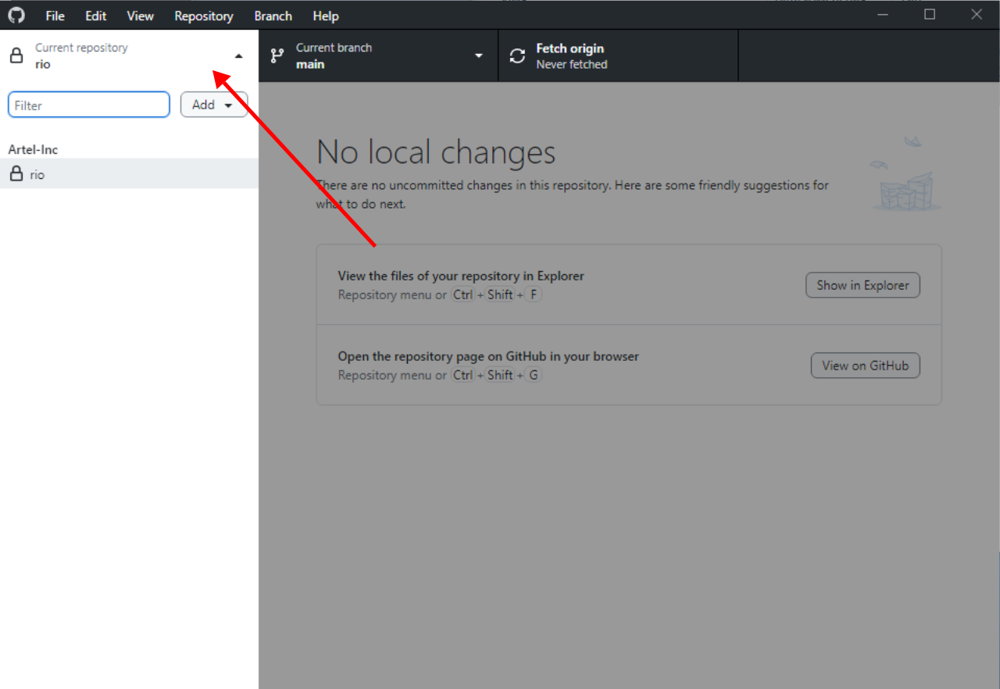
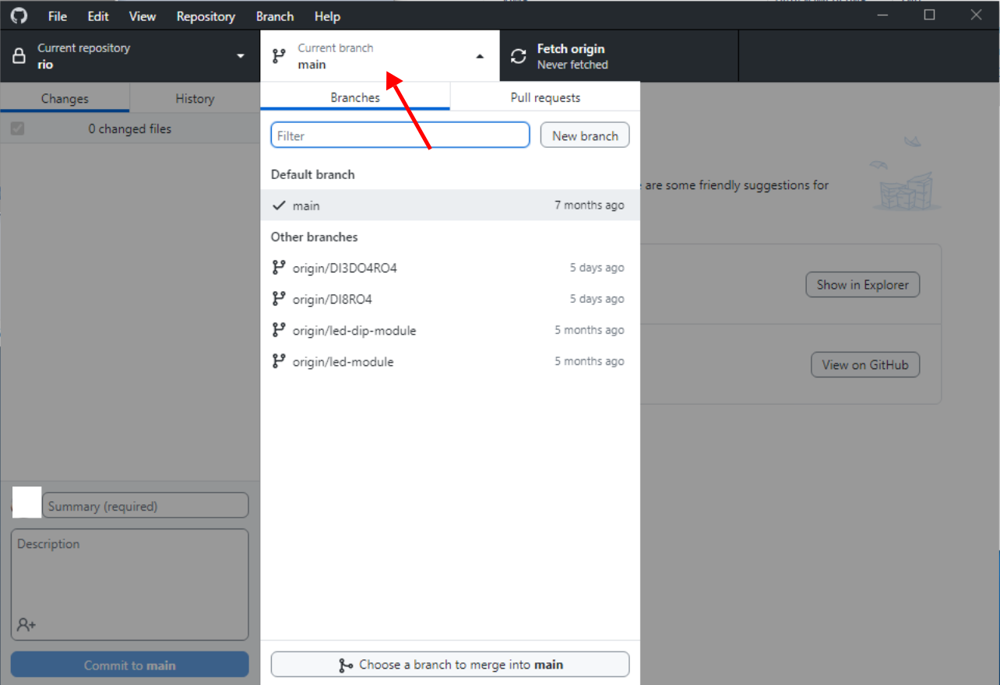
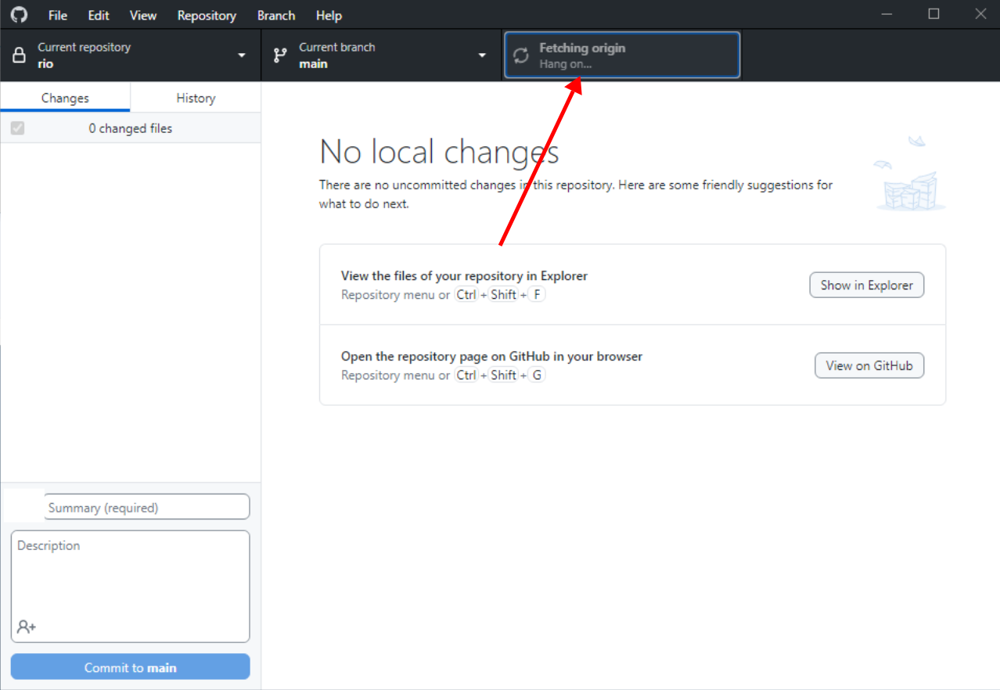
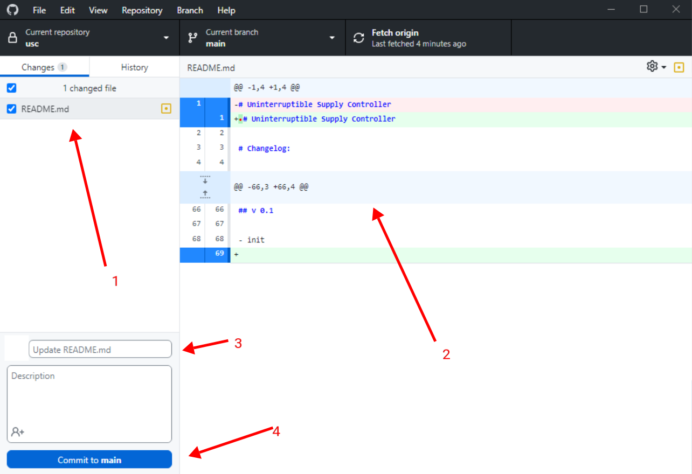
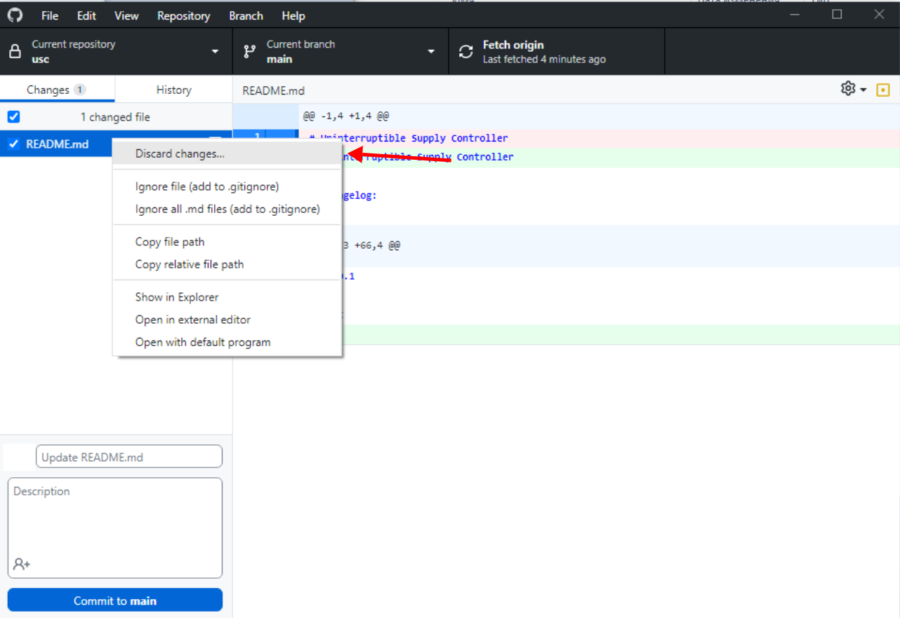
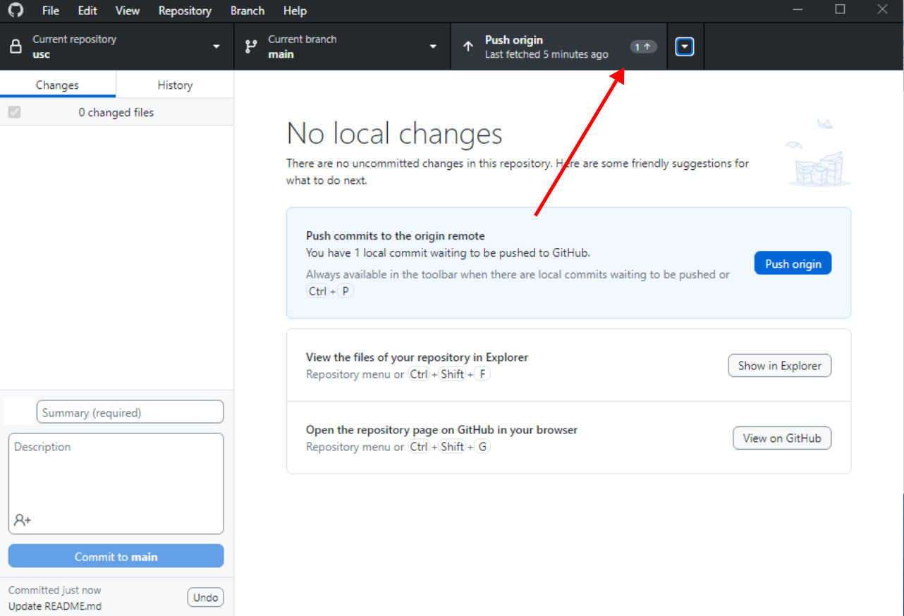

# Контроль версий или немного о GitHub

Для начала, советую ознакомиться с вопросом, что такое git, начать можно с данного видео ролика.

## Базовая инструкция по работе с сайтом GitHub

### Аккаунт

Первое что вам нужно сделать это обзавестись аккаунтом на [GitHub](https://github.com/).

Рекомендации:

- Используете настоящую почту, предпочтительно `gmail`/`yandex`. 
- Используйте не длинный никнейм, никнейм будет фигурировать в истории проекта.
- Используйте двух факторную авторизацию, советую `u2f(Security keys)`/`TOTP(Authenticator app)`
- Обязательно выпустите [`Recovery codes`](https://github.com/settings/security)

Перечисленные пункты важны для комфортной последующей работы. Изменения никнейма или почты повлечет изменения ключей шифрования и цифровой подписи. На начальных этапах это вызовет проблемы с вашей статистикой, на последующих этапах может полностью заблокировать доступ к репозиториям.

Использование двух факторной авторизации будет необходимо для повышения привилегий доступа к корпоративным репозиториям. 

### Репозитории

Github это обещая платформа, для людей из разных отраслей и компаний. На платформе существуют персональные репозитории и репозитории компаний.

Репозитории нашей компании вы можете найти [по ссылке](https://github.com/Artel-Inc).

В первом приближение вам будет выдан доступ к конкретным репозиториям, необходимым для работы. В этом случае вам следует принять приглашение на почте. 

В случае долгосрочного сотрудничества вы получите доступ на чтение всех репозиториев компании. Приглашение отдельное на каждый репозиторий высылаться не будет.

Список доступных репозиториев вы можете найти по ссылке выше или в боковой панели на главной странице.

> [!NOTE]
> СОГЛАСУЙТЕ СОЗДАНИЕ РЕПОЗИТОРИЕВ С РУКОВОДИТЕЛЕМ КОМАНДЫ!!!

### Задачи

В данный момент мы используем `issues` как систему учета задач, вопросов. Задачи закрепляются за конкретным репозиторием !!!

Рекомендации:

- При полученье задачи создайте для нее `issues`, если он еще не создан.
- Используйте метки `issues` в `commit`. Пример: "исправил ошибку переполнения #1"
- Ведите обсуждение решения, проблемы, предложения в `issues`.
- В тексте `issues`, в случае необходимости обратится к конкретному сотруднику укажите его никнейм. Пример: "@MuratovAS"

Список своих задач вы можете найти в правом углу сайта или на странице репозитория:

> [!NOTE]
> ЕСЛИ ВЫ НАЧИНАЕТЕ ВЫПОЛНЯТЬ ЗАДАЧУ, УКАЖИТЕ СЕБЯ В СПИСКЕ ИСПОЛНИТЕЛЕЙ!!!

### Ветки

В текущий момент времени мы руководствуемся концепцией: "Новая задача, новая ветка". Объединять ветки может только руководитель команды. 

> [!NOTE]
> ЕСЛИ ВЫ РАБОТАЕТЕ В ОБЩЕМ РЕПОЗИТОРИИ СОГЛАСУЙТЕ СВОИ ДЕЙСТВИЯ С РУКОВОДИТЕЛЕМ КОМАНДЫ!!!

## Базовая инструкция по работе с GitHub Desktop

В качестве настольного Git клиента вы можете использовать удобный вам инструмент. Если же вы в первые работаете с системой контроля версий воспользуйтесь [`GitHub Desktop`](https://desktop.github.com/), [`GitHub Desktop for linux`](https://github.com/shiftkey/desktop/). 

После авторизации вы уведете перечень доступных вам репозиториев, выберете тот с которым будите работать.

Настоятельно рекомендуем создать папку Git в удобном для вас месте, в последствие там будут храниться копии рабочих репозиториев. В пути к каталогу не должно быть пробелов и отличных от латинских букв. Мы обычно создаем папку `Git` в диске `C:`

### Основные элементы интерфейса

Меню выбора репозитория:

Меню выбора ветки:

Кнопка синхронизации с сервером:
Здесь вы увидите количество не синхронизированных изменений.

Основные элементы интерфейса:

1. Список измененных файлов
2. Изменения в конкретном файле
3. Описание изменений
4. создать коммит

Отмена изменений в файле:

Отправка изменений:

> [!NOTE]
> ОБЯЗАТЕЛЬНО ДЕЛАЙТЕ PULL (синхронизацию репозитория) ПЕРЕД НАЧАЛОМ РАБОТЫ!!!
