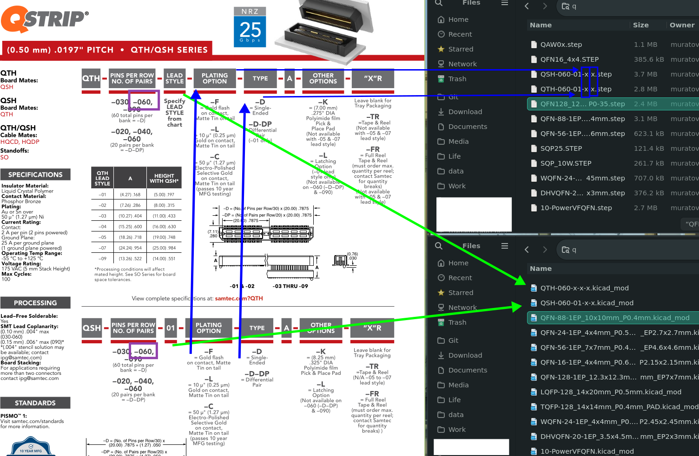

# Именуем правильно

## Общие рекомендации по именованию файлов

- Название должно быть емким, но при этом коротким
- Не используй в названиях кириллицу (решает проблему совместимости с ПО)
- Название должно начинаться с маленькой буквы (значительно упрощает работу с файловой системой из `cli`)
- Не используй `пробел`, используй `-` или `_`
- `CAPSLOCK` вам не друг (почти всегда)
- Избегайте спец символов `~<>?:"';{}[]!№@#$%^&*(),=+\|/ ...`
- Используй предпочтительно [сamelCase](https://ru.wikipedia.org/wiki/CamelCase).
- Располагайте слова имени в порядке значимости или от большего модуля к меньшему

Пример 1:

`freeCad-asm3_v0.3`

```
freeCad - имя в сamelCase формате
asm3 - редакция (часить имени)
v0.3 - версия
```

Данный пример можно записать в сamelCase, но это может повлечь разночтение.  `freeCadAsm3_v0.3` может показаться что это цельное имя, а не редакция программы.

Пример 2:

`rcu_segcblist.c`

```
RCU segmented callback lists, function definitions
```

Данный пример как оформлять имена полностью в нижнем регистре, без сamelCase (lowerCamelCase).

> [!WARNING]
>  `-` разделяет части неделимого имени. `_` отделяет самостоятельные части, версии, блоки.

> [!NOTE]
> Если вы унаследуете код, файлы. Плохой идея будет их переименовывание. Это вызовет путаницу и не соответствие. Рекомендуем унаследовать стиль предыдущего автора. Пример: файл `LICENSE`, этот файл создается и анализируется github, было бы плохой практикой называть его иначе.

> [!NOTE]
> Описанная выше концепция хорошо подходит для имен на которые будет осуществляться какая-либо ссылка (код, файловая система). В тексте документации же рекомендуем использовать место `_` пробел ` ` (если это конечно не ссылка).

> [!TIP]
>  В `linux` дурным тоном считается название запускаемого файла содержащие символы отличные от латиницы, цифр и `-` (все в нижнем регистре).

## Git репозитории

В данный момент предпочтительный стиль именования проектов и репозиториев это 3х символьная аббревиатура. В случаях необходимости разделения на репозитории к имени добавляются постфиксы (пример `udp-a`).

Пример:

- Название проекта на бумаге    - `UDP`
- Расшифровка названия          - `Universal Display Panel`
- Название репозитория          - `udp`
- Репозитория ПО                - `udp-software` 
- Репозитория прошивки          - `udp-firmware` 

## CGD/FP (УГО/ФП)

Разберем процесс именования детали `QTH-060-01-L-D-A-K-TR`. 

Необходимо создать в библиотеке 2 детали для разъема "мама" и "папа". 
Откроем документацию  и определим назначение сегментов имени. 



1)  Отбрасываем не значимые символы. В нашем случае это 3 последних поля
   
   - полн `A`, общее для разъемов, не несет информации, удаляется
   
   - поле `other options`, опция для монтажа, удаляется
   
   - поле `"x"r`, тип упаковки, удаляется

2- Проверяем какие значимые поля влияют на 3д модель
   
   - первое поло `QTH` и `QSH`, тип разъема. Прямое влияние на модель, сохраняем
   
   - поле `PINS`, количество pin.  Прямое влияние на модель, сохраняем
   
   - поле `LEAD STYLE`. Значимо для `QTH`, высота разъема, сохраняем. Для `QSH` не значимо, имеет одно константное значение, находится в середине (отбросить нельзя). Сохраняем для обеих моделей.
   
   - поля `PLATING` и `TYPE` не влияют на 3д модель, могут быть любыми. сохраняем прописывая `x`, указывая что возможно любое значение.

3- Проверяем какие значимые поля влияют на FP модель. Процедура аналогична предыдущему пункту. За исключением поля `LEAD STYLE` для `QTH`, в отличии от 3d модели FP не меняется в зависимости от высоты разъема. 
