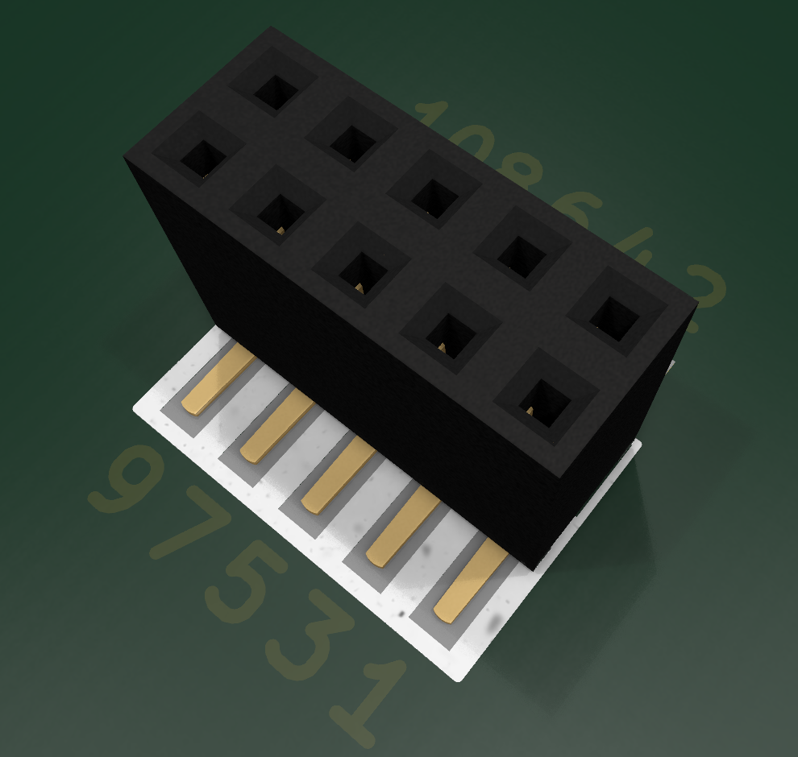
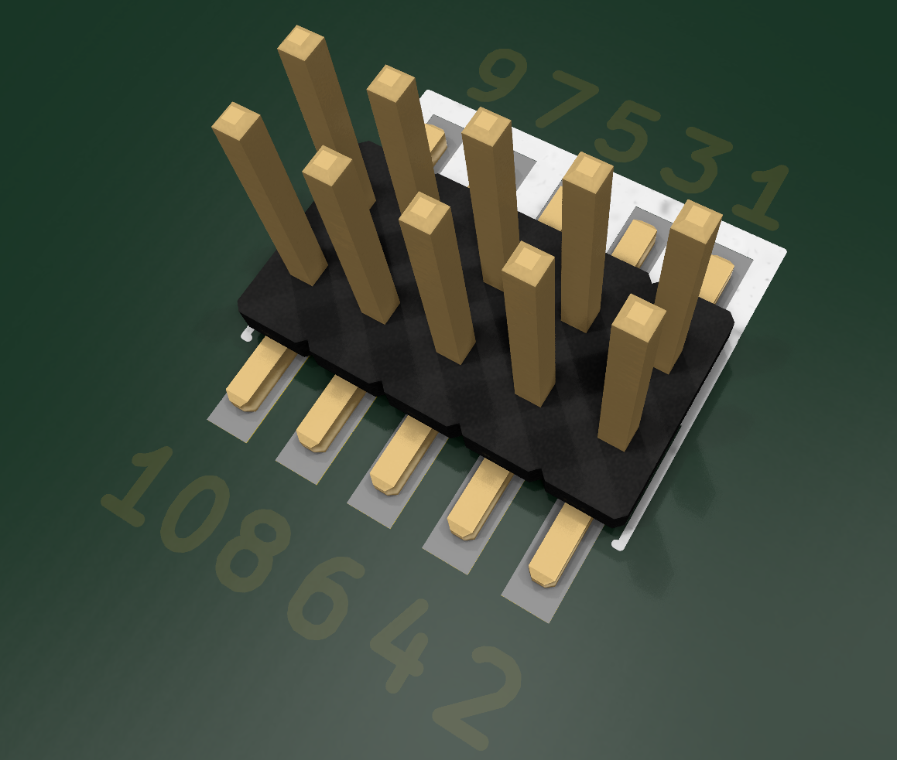

# Универсальный порт отладки SWD/JTAG/UART

Для целей отладки используется единый стандартный порт.

> [!Important]
> 
> Разъем не имеет ключа, вследствие чего имеется 2 комбинации втыкания. Для правильной стыковке совместите ключи! Они должны соответствовать рисункам ниже.

> [!NOTE]
> 
> Программатор должен содержать токоограничивающее резисторы на линиях данных, а не целевое устройство.

### Целевое устройство

| #   | Мнемоника      | Функция                              |
| --- | -------------- | ------------------------------------ |
| 1   | `VDD`          | Питания платы [5v]                   |
| 2   | `GND`          | Общий провод                         |
| 3   | `NRST`         | Сброс `MCU`                          |
| 4   | `VCC`          | Питания `MCU` [3.3v]                 |
| 5   | `UART_TX`      | `USART1` поддерживаемый `bootloader` |
| 6   | `UART_RX`      | `USART1` поддерживаемый `bootloader` |
| 7   | `BOOT0`/`TDI`  | `BOOT0` или `TDI` (через резистор)   |
| 8   | `SWO`/`TDO`    | `SWO` или `TDO` (через резистор)     |
| 9   | `SWDCLK`/`TCK` | Тактовая линия `SWD`                 |
| 10  | `SWDIO`/`TMS`  | Линия данных `SWD`                   |

- CGD (УГО): `Connector_Generic:Conn_02x05_Odd_Even`
- FP (ФП) [SMT]: `PinSocket_2x05_P1.27mm_Vertical_SMD`
- FP (ФП) [DIP]: `PinSocket_2x05_P1.27mm_Vertical`
- LCSC: `C2684733`

### Программатор

Нумерация контактов идентична целевому устройству. За исключением перевернутого **TX/RX** у UART на стороне программатора.

- CGD (УГО): `Connector_Generic:Conn_02x05_Odd_Even` 
- FP (ФП) [SMT]: `PinHeader_2x05_P1.27mm_Vertical_SMD` 
- FP (ФП) [DIP]: `PinHeader_2x05_P1.27mm_Vertical` 
- LCSC: `C2935458` или `C2881910` или `C783829`(вариант с защитой)

> [!WARNING]
> 
> Нумерация `PinSocket` и `PinHeader` отличается. При использование указанных выше компонентов **зеркалить** ничего не нужно!!! 
