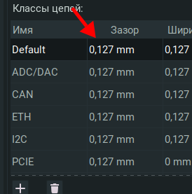
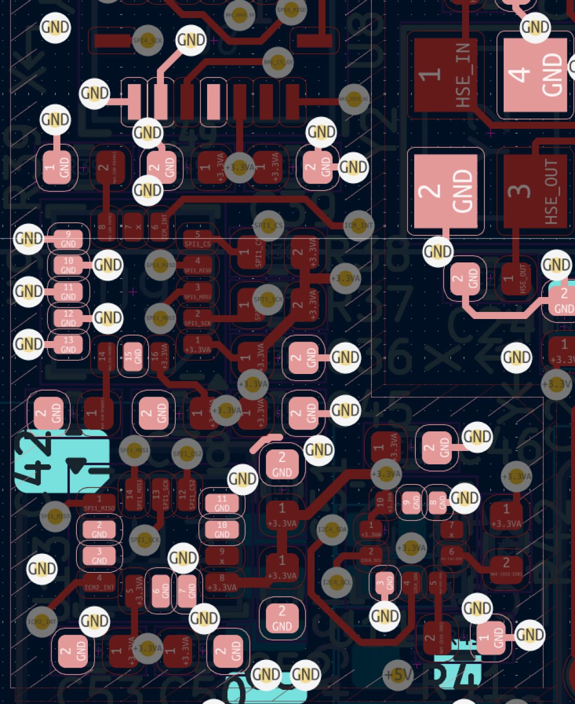
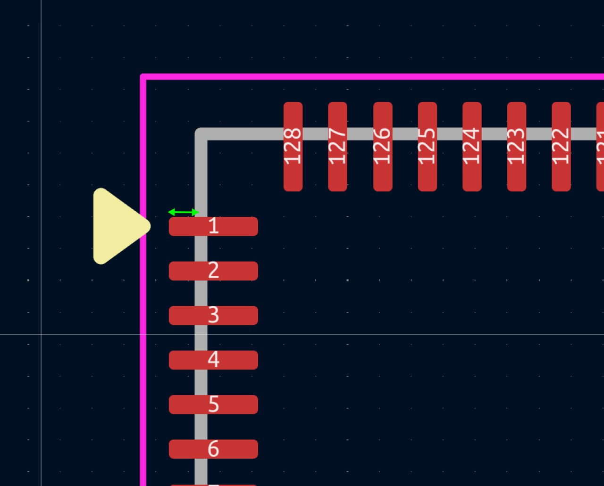

# Рекомендации по работе с pcb в kicad.

Если проектируешь, проектируй красиво. 

Если вы редактируете чужую pcb, повторяйте ее стилистически. Не изобретай велосипед, унаследуй практики.

Если используете модули из других репозиториев, читайте `README.md`. Там могут быть важные замечания.

На сегодняшний день разработка новых плат ведется в метрической системе координат. Разработка схемотехники как и прежде в дюймовой.

## Общие рекомендации

| Рекомендации:                                                                                                                                                                                                                                                                                                                                                                                     | Почему это важно:                                                                                                                                                                                                                                                                                                                                   |
| ------------------------------------------------------------------------------------------------------------------------------------------------------------------------------------------------------------------------------------------------------------------------------------------------------------------------------------------------------------------------------------------------- | --------------------------------------------------------------------------------------------------------------------------------------------------------------------------------------------------------------------------------------------------------------------------------------------------------------------------------------------------- |
| Настройки полигона. Избавляйтесь от острых углов. Используйте скругления.                                                                                                                                                                                                                                                     | - Острый угол точка потенциального пробоя - Чертеж выглядит аккуратнее, более проработанным                                                                                                                                                                                                                                                    |
| Настройки полигона. Зазор и минимальная ширина обычно имеют одинаковое значение. Зазор полигона не должен быть больше зазора дорожки (минимального) определенного в классе цепи.                                                                               | - Отклонение от этой рекомендации влечет нарушения импеданса предварительно настроенных цепей                                                                                                                                                                                                                                                       |
| Зазор терморазгрузки может быть равен зазору между дорожками, но лучше использовать значение зазора из более грубого класса цепей. Например, зазор между дорожками 0.127, зазор терморазгрузки 0.2 (зазор для более грубого класса цепей) Мостик же выбирается наиболее широкий исходя из корпусов используемых деталей  | - Слишком большей зазор терморазгрузки блокирует заливку в узких местах - Зазор терморазгрузки равный зазору дорожки усложняет производство (лучше использовать для этого параметра "зазор спераливидных проводников") - Мостик, более широкий мостик уменьшает потери в точки соединения. Но повышает процент брака из-за непропая  |
| Используйте сглаживание углов полигона через настройки полигона, а не вручную рисуя скосы. Старайтесь делать одинаковые отступы со всех сторон полигона. Было: Стало:                                                                                | - Упрощает последующее редактирование - Позволяет глобально изменять параметры скосов                                                                                                                                                                                                                                                          |
| Для получения предсказуемых углов скругления на границе платы. Устанавливайте границу полигона с учетом отступа от края платы. Было:  Стало:                                                                                                    | - Эстетические моменты                                                                                                                                                                                                                                                                                                                              |
| Дорожки необходимо подводить к центру пада было:  Стало:                                                                                                                                                                                        | - Подключение не к центру не позволяет в последующем согласовывать длину линии                                                                                                                                                                                                                                                                 |
| Старайтесь уменьшить количество разрывов в опорном слое. Было: Cтало:                                                                                                                                                                                | - Меньше проблем с ЭМС - Равномерный опорный слой                                                                                                                                                                                                                                                                                              |
| Избегайте 'окон' Было: Стало:                                                                                                                                                                                                                        | - Равномерная земля - Больше точек контакта земли - Экранировка цепей                                                                                                                                                                                                                                                                     |
| Начинайте трассировать плату с цепей чувствительных к импедансу.  Было: Стало:                                                                                                                                                                       | - Повышает общее качество и работоспособность платы                                                                                                                                                                                                                                                                                                 |
| Левый верхний угол платы необходимо поместить в позицию с абсолютными координатами 30х30мм. А так же перестать в эту координату начло сетки и сверловки.                                                                                                  | - Избавляет от ошибок с началом координат в производственных файлах                                                                                                                                                                                                                                                                                 |
| Устанавливайте `vias` для `gnd` около каждого вывода перед началом трассировки.                                                                                                                                                                                                                                                                                                                   | - Позволяет получить гарантированно стабильные земли в цепях питания чипов.                                                                                                                                                                                                                                                                         |
| Если тех. процесс предусматривает фрезеровку. Скругляйте контур платы.                                                                                                                                                                                                                                                                                                                            | - Упрощает монтаж платы в блок                                                                                                                                                                                                                                                                                                                      |
| Отключите значения и обозначения у `H?` и `FID?`, эти элементы не требуют установки.                                                                                                                                                                                                                                                                                                              | - Повышает читаемость                                                                                                                                                                                                                                                                                                                               |
| Используйте для копирования однотипных трассировок плагин:                                                                                                                                                                                                                                                                    | - Единообразие топологии                                                                                                                                                                                                                                                                                                                            |
| Шелкография должна быть читаема. Уменьшите ее в соответствии с требованиями (производства/руководителя)                                                                                                                                                                                                                                                                                           | - Удобство работы с платой                                                                                                                                                                                                                                                                                                                          |
| Если в проекте определены классы цепей, используйте автоматическое определение ширины дорожке и размеров отверстий.                                                                                                                                                                                                           | - Избавляет от ошибок с активным и волновым сопротивлением                                                                                                                                                                                                                                                                                     |
| рекомендую между полигонами делать контролируемый зазор ) что бы он не менялся от тех норм.                                                                                                                                                                                                                               | - Предсказуемый диэлектрический зазор. - Упрощает последующее редактирование полигонов.                                                                                                                                                                                                                                                        |
| Что бы были красивые скругления между двумя полигонами одной цепи. нужно делать нахлесты                                                                                                                                                                                                                                      | - Эстетические моменты                                                                                                                                                                                                                                                                                                                              |
| Делайте одинаковые зазоры в группе проводников. Было: Стало:                                                                                                                                                                                         | - Эстетические моменты                                                                                                                                                                                                                                                                                                                              |
| Используйте скругления полигонов. Удаляйте островки. делайте терморазгрузку.                                                                                                                                                                                   | - Эстетические моменты                                                                                                                                                                                                                                                                                                                              |
| "Экранируй", по возможности, сигнальные линии  опорным слоем вокруг.  В идеале иметь возможность поставить отверстие между разнородными сигналами. Плохой вариант: Хороший вариант:                                                                                                                     | - Целостность сигнала                                                                                                                                                                                                                                                                                                                               |
| Избегай дорожек между падами. зеленая хорошо, синие плохо:                                                                                                                                                                                                                                                                                           | - Упрощает работу производства - Корректнее расчесывается длинна трассы                                                                                                                                                                                                                                                                         |
| Делай отступ от крепежных элементов на топологии.                                                                                                                                                                                                                                                                                                    | - Избавляет от замыканий и некачественного монтажа                                                                                                                                                                                                                                                                                                  |
| Стремитесь к однородному импедансы на трассе (толщина/зазор сигнальной линии должна быть одинаковая на всем пути). СВЧ тракты должны быть строго рассчитаны. Было: Стало:                                                                                                                               | - Целостность сигнала                                                                                                                                                                                                                                                                                                                               |
| Избегайте дорожек под 90 градусов. Старайтесь схожие элементы топологии делать одинаковыми.                                                                                                                                                                                                                                                          | - Целостность сигнала - Эстетические моменты                                                                                                                                                                                                                                                                                                    |
| В случае когда термобарьеры не позволяют осуществить стабильное подключение, используйте локальный полигон с меньшим или отсутствующим термобарьером. Было: Стало:                                                                                                                                      | - Нагрузочная способность линии                                                                                                                                                                                                                                                                                                                     |
| Старайтесь использовать монолитные полигоны в питании. Было: Стало:                                                                                                                                                                                                                                     | - Упрощает последующее редактирование - Нагрузочная способность линии                                                                                                                                                                                                                                                                           |
| Не используйте сложные формы полигонов. Их невозможно редактировать.                                                                                                                                                                                                                                                                                 | - Упрощает последующее редактирование                                                                                                                                                                                                                                                                                                               |
| Используйте возможность выравнивания у текста. Подписи компонентов предпочтительно ставить на осях компонента (когда это возможно).                                                                                                                                                                     | - Упрощает последующее редактирование - Эстетические моменты                                                                                                                                                                                                                                                                                    |
| Избегайте соединения с полигонами по средствам дорожек. Настройте полигон. Было: Стало:                                                                                                                                                                                                                 | - Упрощает последующее редактирование - Нагрузочная способность линии                                                                                                                                                                                                                                                                           |
| Опорный слой это важно. Старайтесь около всех выводов GND,  ставить отверстие соединяющее с опорным слоем.                                                                                                                                                                                                                                               | - Целостность сигнала                                                                                                                                                                                                                                                                                                                               |
| Старайтесь ставить конденсатор максимально близко к выводам питания. Плохой пример, тут необходимо повернуть конденсатор на 180 градусов:                                                                                                                                                                                                            | - Целостность сигнала                                                                                                                                                                                                                                                                                                                               |
| Используйте для СВЧ каскада свой собственный полигон, с собственными настройками.                                                                                                                                                                                                                                                                    | - Целостность сигнала                                                                                                                                                                                                                                                                                                                               |
| Избегайте островков подключенных в одной токе.                                                                                                                                                                                                                                                                                                       | - Эстетические моменты                                                                                                                                                                                                                                                                                                                              |
| Компонуй компактнее. Было: Стало:                                                                                                                                                                                                                                                                       | - Эстетические моменты - Повышает плотность монтажа.                                                                                                                                                                                                                                                                                            |
| Снижайте количество пересечений при компоновке. Было: Стало:                                                                                                                                                                                                                                            | - Общее качество трассировки                                                                                                                                                                                                                                                                                                                        |
| Ставь компоненты по сетке!!!!! Пример не по сетке:                                                                                                                                                                                                                                                          | - Общее качество трассировки - Упрощает последующее редактирование                                                                                                                                                                                                                                                                              |
| Избегайте "змеек". Перенесите на другой слой.                                                                                                                                                                                                                                                                                                            | - Общее качество трассировки                                                                                                                                                                                                                                                                                                                        |
| Избегайте соединения рядом стоящих падов прямой линией. Выведете ее за пределы группы пайки. Было: Стало:                                                                                                                                                                                               | - Упрощает работу производства - Упрощает отладку                                                                                                                                                                                                                                                                                               |

## Разработка FP

| Рекомендации:                                                                                                                                                                                                          | Почему это важно:                                                                        |
| ---------------------------------------------------------------------------------------------------------------------------------------------------------------------------------------------------------------------- | ---------------------------------------------------------------------------------------- |
| Используй стандартную толщину линии для вспомогательных слоев.  - Silk = 0,12mm - Fab = 0,1mm - Courtyard =  0,05mm - TEXT = 0,15mm                           | - Не перегружай чертеж                                                                   |
| Используйте треугольник для маркировки первого вывода.                                                                                                                        | - Единообразие с оф библиотекой - Явное указание первого вывода                      |
| Pad под qfn должен выступать за пределы корпуса на 0.2мм                                                                                                                      | - Возможность ручного монтажа - Возможность контроля качества пайки без спец средств |
| Не стоит надеяться на шелкографию при маркировки первого вывода, она может быть повреждена или утрачена. По возможности используйте общепринятые обозначения на медных слоях. | - Единообразие с оф библиотекой - Явное указание первого вывода                      |
| Не дописывай 0 при нумерации выводов, это заблокирует возможность использовать стандартные УГО. Было: Cстало:                | - Единообразие с оф библиотекой                                                          |
| Рекомендую использовать пады с закругленными краями, но не круглыми.                                                                                                          | - Эстетические моменты                                                                   |
