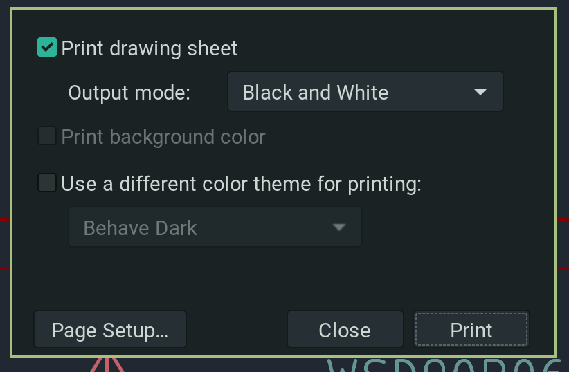

# Подготовка КД `Kicad` к производству

> [!WARNING]
>
> Данная инструкция описывает процесс ручной подготовки файлов. 


Mainline: `kicad 8`

Перечень стандартных файлов:

- STEP - 3D модели [`???_v??.step`]

- Gerber + DRL - фото шаблоны и карта сверления [`???_v??.zip`]

- BOM - перечень элементов [`???_v??_bom.csv`]

- CPL - файл позиций для расстановщика [`???_v??_cpl.csv`]

Дополнительные материалы:

- ASM - Сборочный чертеж [`???_v??_asm.pdf`]

- SCH - Схема [`???_v??_sch.pdf`]

- PCB - Печатная плата [`???_v??_pcb.pdf`]

  
> [!WARNING]
>
> Рекомендованное место хранения производственных файлов, каталог `manufacturing`. Файлы должны быть названы в соответствии с шаблонами приведенными выше. Для исключения конфликтов со скриптами.

## Подготовка `STEP`

В `PCB Editor`:


> [!NOTE]
>
> Если PCB спроектирована НЕ в абсолютной системе координат, советуем использовать `начало координат сверловки/размещения`

## Подготовка `Gerber + DRL`

В `PCB Editor`:


> [!NOTE]
>
> В случае многослойных плат, не забудьте включить внутренние слои. Например: `In1.Cu`

## Подготовка `CPL`

В `PCB Editor`:


## Подготовка `BOM`

В `SCH Editor`:


> [!Important]
>
> Включите группировку строк по полям характеризующим физический смысл компоненты. Например: `value`, `voltage`, `coefficient`, `footprint`.

> [!NOTE]
>
> Включите отображение полей имеющих смысл для закупщиков, сборщиков. Не отображайте пустые поля.

> [!WARNING]
>
> Все ячейки имеющие значение 'смешанный', требуют повторной тщательной проверки. Это потенциальные ошибки и неточности.

## Подготовка SCH

В `SCH Editor`:




Особых правил выгрузки нет. Отправьте файл на печать в `Print to pdf`. Переместите файл в `manufacturing` с соответствующим названием.

## Подготовка ASM

В `PCB Editor`:


Особых правил выгрузки нет. Отправьте файл на печать в `Print to pdf`. Переместите файл в `manufacturing` с соответствующим названием.

## Подготовка PCB

В `PCB Editor`:


Особых правил выгрузки нет. Отправьте файл на печать в `Print to pdf`. Переместите файл в `manufacturing` с соответствующим названием.

## Пост обработка

Некоторые производства требовательны к структуре файлов. В частности `JLC`, для него требуется `CPL` и `BOM` специального вида. 
Для упрощения создания таких файлов есть скрипт `manufacturing/postProcessor.sh`. Вызовите его для преобразования файлов. Передайте в качестве названия шифр в соответствии с шаблоном. Например: `usc_v01`

```bash
#!/bin/sh

NAME=${1}

mv main.step ${NAME}.step

zip -r ${NAME}.zip gerber
rm -rf gerber

mv main-all-pos.csv  ${NAME}_cpl.csv
sed -i 's/Ref/Designator/' ${NAME}_cpl.csv
sed -i 's/PosX/Mid X/' ${NAME}_cpl.csv
sed -i 's/PosY/Mid Y/' ${NAME}_cpl.csv
sed -i 's/Rot,/Rotation/' ${NAME}_cpl.csv
sed -i 's/Side/Layer/' ${NAME}_cpl.csv

mv main-ibom.html  ${NAME}_ibom.html
mv main-bom.csv		 ${NAME}_bom.csv
sed -i 's/"Value"/Comment/' ${NAME}_bom.csv
sed -i 's/"Reference"/Designator/' ${NAME}_bom.csv
sed -i 's/"Footprint"/Footprint/' ${NAME}_bom.csv
sed -i 's/"lcsc"/LCSC/' ${NAME}_bom.csv
```

