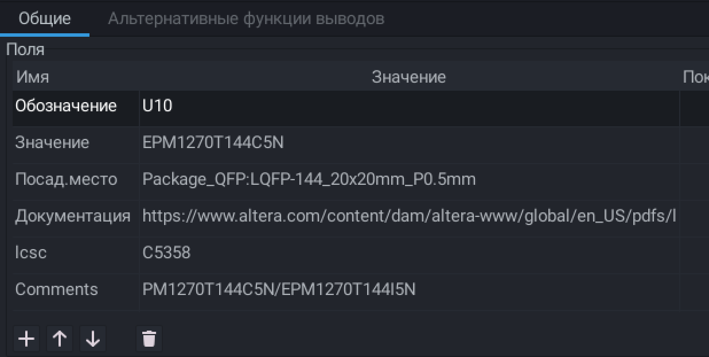

# Рекомендации по работе со схемой в kicad.

Стиль это важно. Если проектируешь, проектируй красиво. 

Схема должна быть информативной, понятной, единообразной.

Схема может содержать заметки, расчеты, предупреждения. 

Если вы редактируете чужую схему, повторяйте ее стилистически. Не изобретай велосипед, унаследуй практики.

Если используете модули из других репозиториев, читайте `README.md`. Там могут быть важные замечания.

На сегодняшний день разработка новых плат ведется в метрической системе координат. Разработка схемотехники как и прежде в дюймовой.

## Общие рекомендации

| Рекомендации:                                                                                                                                                                                                                                                                            | Почему это важно:                                                                                               |
| ---------------------------------------------------------------------------------------------------------------------------------------------------------------------------------------------------------------------------------------------------------------------------------------- | --------------------------------------------------------------------------------------------------------------- |
| Главный лист называется main, включает в себя устройство целиком или же отражает межблочные соединения.                                                                                                                                                                                  | - Необходимо для автоматизации - Всегда понятно с чего начинать                                            |
| Формат листа определяется геометрией схемы. На листе не должно быть свободного места. Предпочтительные форматы: А2, А3, А4, А5                                                                                                                                                       | - Экономия при печати - Повышает читаемость                                                                |
| Сигнал на листе должен распространяться:  - Слева-направо - Сверху-вниз. NOTE: Сверху питания, снизу земля                                                                                                                                                                | - Повышает читаемость                                                                                           |
| Схема должна быть разбита на логические блоки. Логические блоки должны иметь название.                                                                                                                               | - Повышает читаемость                                                                                           |
| Типичный шаблон разбиения листа. - Питание - Основные каскады - Дополнительные каскады                                                                                                                                                                                       | - Повышает читаемость                                                                                           |
| Заполняйте рамку. Обязательные поля: - Дата - Номер изм. (версия) - Наименование (шифр проекта) - Организация (в некоторых случаях расшифровка наименования) - Разработал - Утвердил NOTE: Наименование может отличаться на разных листах             | Необходимо знать: - Какой проект - Кто автор - Что на схеме                                      |
| Используйте универсальные компоненты для стандартизированных деталей таких как [Рекомендованный УГО]: - Резисторы [R_Small] - Конденсаторы [C_Small/C_Polarized_Small] - Индуктивности [L_Small] - Диоды...  [D_Small/LED_Small/D_Schottky_Small] - Connector...... | - Small версии занимают меньше места - Легко делать замену                                                 |
| Используйте символы питания только в случае множественного соединения.                                                                                                                                                                                                                   | - Меньше символов, меньше ошибок.                                                                               |
| Не используйте `инструмент шина`.                                                                                                                                                                                                                                                        | - Устаревший инструмент (создан для рисования жгутов проводов, на плате их нет) - Используйте `метки цепи` |
| Избегайте использования `глобальных меток`.                                                                                                                                                                                                                                              | - Добавляет разночтения - Усложнят понимание схемы                                                         |
| Используйте `графисекую линию` для иллюстрации гальванической развязки (2 линии). Указывайте `текстом` принадлежность домену питания (ex. gnd/gnda).                                                                 | - Позволит визуально оценивать принадлежность группы сигналов, без открытия листа                               |
| Обязательно указывайте тип сигнала при использовании `иерархического листа` .                                                                                                                                                                                                            | - Позволяет автоматизировать проверку сигналов                                                                  |
| Используйте `иерархический лист` для каскадов с повторяющейся схемой (более 2х раз).                                                                                                                                                                                                     | - Позволит скопировать топологию платы - Избавит от повторяющейся работы                                   |
| В случае наличия большого количества иерархических листов, разработайте алгоритм нумерации одинаковых блоков. Отличный вариант смещение разряда `обозначений`.                                                       | - Автоматизирует расстановку шелкографии - Повышает читаймость                                             |
| Для компонентов не требующих установки указывайте `DNP` и `исключить из перечня элеметов`.                                                                                                                           | - Избавит закупщиков от проблем                                                                                 |
| Не размещайте текст внутри компонент. Особенно касается резисторов.                                                                                                                                                                                                                      | - Значительно усложняет доступ к меню редактирования.                                                           |
| Включайте отображения критической информации. Используйте единообразный порядок полей. - Напряжение конденсаторов. - Точность резисторов <1%                                                                 | - Упрощает выявление ошибок.                                                                                    |
| Добросовестно заполняйте свойства символа.                                                                                                                                                                           | - Упрощает закупку  - Позволяет быстро подобрать аналог  - Возможность глобальных замен поставщиков     |
| Используйте единую систему наименования полей свойств. Обаятельные поля:  - lcsc - Comments                                                                                                                                                                                 | - Автоматизация                                                                                                 |
| В случае необходимости именовать одну цепь разорванную резистором используйте префикс `_`.                                                                                                                           | - Читаемость на плате - В некоторых случаях возможность согласования линии                                 |
| Стремитесь располагать детали на общих осях симметрии (в том числе в разных каскадах) [синяя линия].  Так же располагать детали на равном удалении друг от друга и близлежащих проводников [красная стрелка].    | - Повышает читаемость                                                                                           |
| Делайте отвод дорожки от пинов. В примере 2 клетки (сетка 50mil).                                                                                | - Удобство последующего редактирования.  - Не блокирует возможность подключить еще один проводник к точке.  |
| Не изменяйте сетку. Сетка должна быть выбирается один раз при создании проекта. Оставьте по умолчанию или выберете 50mil.                                                                                                                                                                | - Исключает ошибки стыковки элементов                                                                           |
| Старайтесь делать каскады читаемыми, компактным. Было:  Стало:                                                                                                                             | - Повышает читаемость                                                                                           |
| Старайтесь размещать элементы на одной оси, в одном направлении, избегайте пересечения. Было: Стало:                                                                                           | - Повышает читаемость                                                                                           |
| Делаете единообразные интервалы. Было: Стало:                                                                                                                                                  | - Повышает читаемость                                                                                           |
| Не проводите перпендикулярную линию прямо к выводу детали.  Было: Стало:                                                                                                                       | - Удобство редактирования                                                                                       |

## Разработка УГО

Для УГО справедливы общие рекомендации.
Более детальные требования к распорядку работы с библиотекой описаны в репозитории оной.

| Рекомендации:                                                                                                                                                                                   | Почему это важно:                                                                                            |
| ----------------------------------------------------------------------------------------------------------------------------------------------------------------------------------------------- | ------------------------------------------------------------------------------------------------------------ |
| Не изменяй кардинально стиль обозначения. Унаследуй стиль библиотеки в которой работаешь. Лучшая практика повторять стиль официальной библиотеки.                                               | - Не создавай себе бессмысленную работу - Позволяет унаследовать опыт сообщества                        |
| Шаг пинов должен быть 100 mil. Можно изменять сетку для отрисовки схематичных изображений.                                                                                                      | - Избавит от проблемы стыковки компонентов из разных библиотек.                                              |
| Центр УГО должен находится в центре осей координат. Если это сделать невозможно, допускается смещение по одной из осей.                                                                         | - Единообразие со стандартной библиотекой                                                                    |
| Обозначай гальваническую развязку пунктирной линией.                                                                        | - Упрощает чтение схемы                                                                                      |
| Рисуй, УПРОЩЕННО внутреннюю структуру типовых элементов.                                                                    | - Дополнительно позволяет определить правильность подключения                                                |
| Не изобретай свое собственное обозначения типичных деталей.                                                                 | - Не стандартное отображение влечет путаницу в чтении схемы.                                                 |
| Используй длину вывода 100mil. В случае нехватки места для размещения обозначения, может быть кратно увеличена.                                                                                 | - Повышает читаемость  - Исключает проблему стыковки                                                     |
| Используй наложение невидимых контактов в случае дублирование сигналов требующих обязательного соединения.                  | - Упрощает схему                                                                                             |
| Если чип подразумевает различные варианты расположения сигналов. Не скрывай, не используемые выводы.                        | - Избавляет от необходимости отрисовыват все варианты распиновок                                             |
| Используй универсальные УГО, для каноничных чипов. Которые могут произвести разные производители с разными наименованиями.  | - Пере используй, оптимизируй.                                                                               |
| Делай заливку внутри блока.                                                                                                 | - Единообразие с стандартной библиотекой                                                                     |
| Не создавай у УГО поля, присущие конкретным поставщикам, делай это на схеме а не в библиотеки.                              | - Деталь станет универсальной для всех. \- Избавит от ошибки неактуального P/N и неподходящего "аналога" |
| Создаешь новую деталь, поищи максимально похожее обозначение в стандартной библиотеки и унаследуй его.                                                                                          | - Единообразие - Меньше работы - Меньше ошибок                                                       |
| Типичное расстояние между выводами в УГО = 100 mil.  шаг установки выводов 100mil                                                              | - Единообразие                                                                                               |
| Расточение от первого вывода до края уго не должно быть меньше чем шаг выводов (100 mil)                                                       | - Единообразие                                                                                               |
| Учитывайте при проектировании УГО будущие потенциальные подключения на схеме.                                                                          |                                                                                                              |

## Разработка схемы

Рекомендации по разработке схемы формулируются текущей командой, определяются опытом и внутренним распорядком.

| Рекомендации:                                                                                                                                                                                                                                 | Почему это важно:                                                                                            |
| --------------------------------------------------------------------------------------------------------------------------------------------------------------------------------------------------------------------------------------------- | ------------------------------------------------------------------------------------------------------------ |
| В случае если схема рассчитана с конкретной деталью. Но в процессе эксплорации она была заменена, исправь это в схеме. Если же деталь была временна заменена на аналог, P/N не соответствует наименованию детали. Укажите в конце имени `(!)` | - Позволяет при анализе схемы оценить допущения                                                              |
| Не используемые выводы, функции выводите на резисторы или тест-поинты. Исходя из доступного пространства, в соответствии с потенциальным расширением функций.                                                                                 | - Позволяет исследовать деталь, без разработки новой платы. - Позволяет произвести быстрое исправление. |
| Все сигналы спрятанные на внутренних слоях должны иметь возможность размыкания на внешних слоях. Это может быть реализована по средствам отпайки резисторов, или отгибания вывода.                                                            | - Доработка ошибок на плате, без изготовления нового образца.                                                |
| Не используйте префиксную нотацию для именования различных сигналов.                                                                                                                                                                          | - В некоторых случаях блокирует возможность автоматического определения класса цепи.                         |
| Выбирайте детали имеющие аналоги у разных производителей.                                                                                                                                                                                     | - Избавляет от необходимости изменения платы в случае отсутствие детали у поставщика                         |
| Выбирайте детали имеющие корпус `с ножками` под поверхностный монтаж.                                                                                                                                                                         | - Значительно упрощает отладку - Упрощает сборку - Снижает требования к PCB                          |
| Прописывайте аналоги и P/N детали                                                                                                                                                                                                             | - Позволяет автоматизировать производство плат - На плате установлена та деталь что выбрал разработчик  |
| Не плодите сущности. Стремитесь уменьшению количество позиций в BOM. Используйте одинаковые детали по возможности, как в рамках одного проекта, так и в рамках всей продукции.                                                                | - Каждая позиция это дополнительная работа                                                                   |
