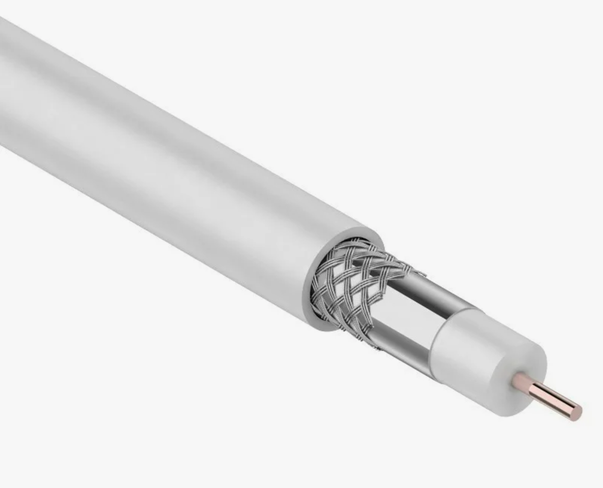
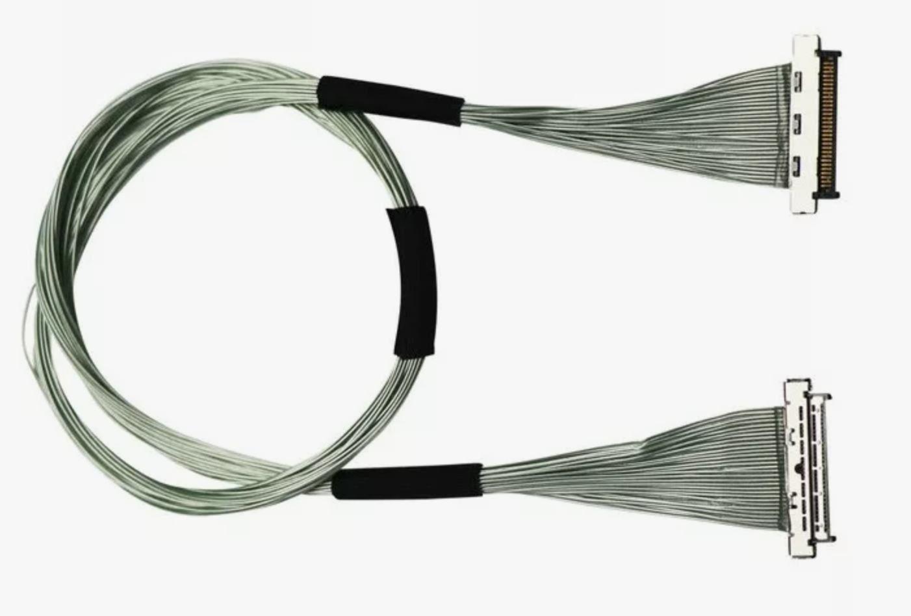
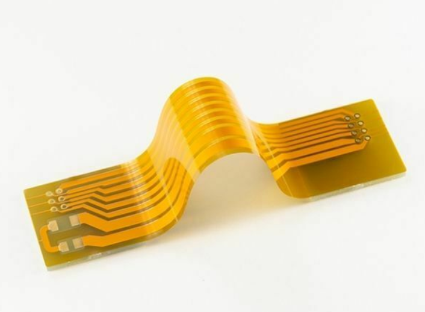
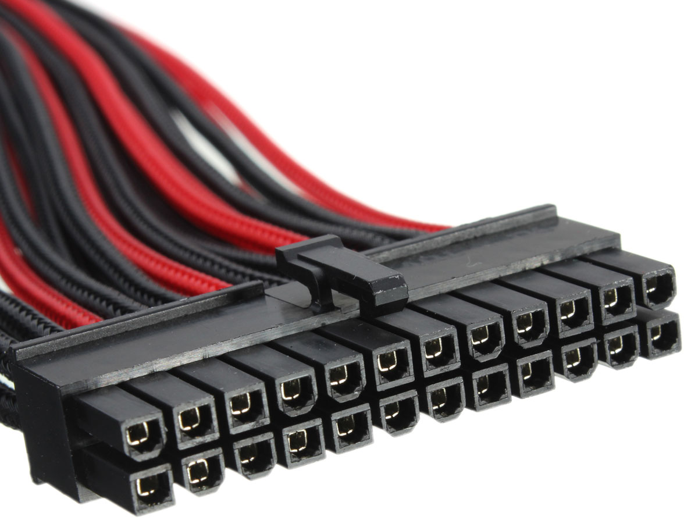
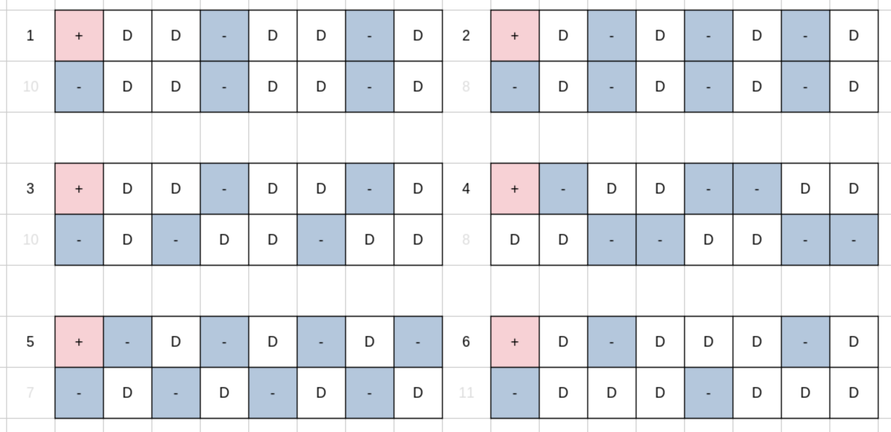
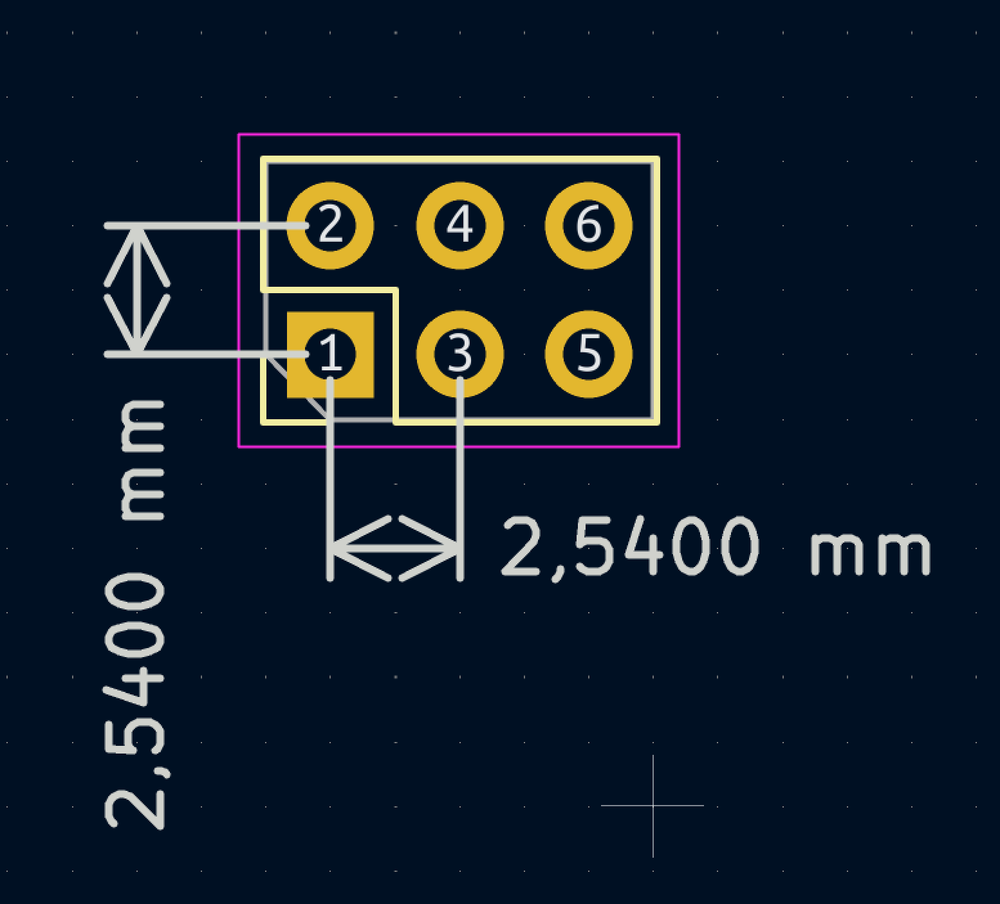
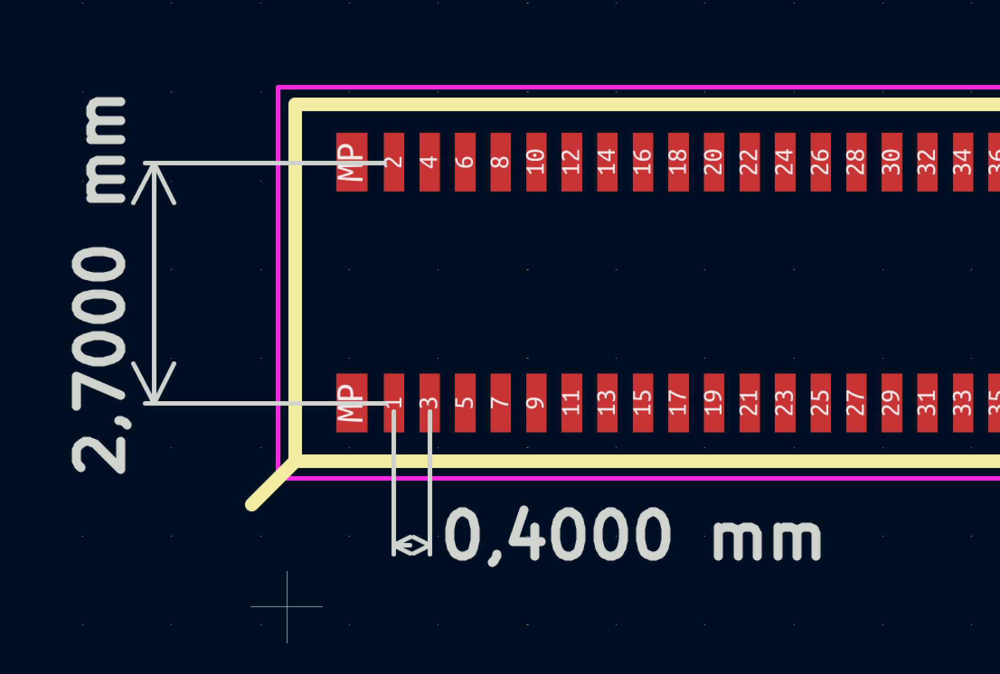

# Рекомендации по компоновке выводов в соединителях

С целью унификации соединительных разъемов, был создан данный документ, описывающий базовые принципы компоновки сигнальных линий, практические и теоретические наблюдения.
Проблемы которые требуется решить:

- Единообразие и совместимость устройств
- ЭМС и целостности сигнала

## Краткий экскурс в теорию

Рассмотрим основные типы, часто используемые.

### Типы сигналов:

- Аналоговый (Например сигнал с `NTC` резистора)
  
  

- Цифровой-дискретный (Например `CAN`)
  
  

- Цифровой-бинарный (Например `UART`)
  
  
  

### Типы линий передачи сигнала:

- Одиночный (Например разовая команда)

- Дифференциальный (Например `RS485`)

Сигналы на линии могут быть как аналоговыми, так и цифровыми. Так же сигналы могут образовывать шины дифференциальных (Например `CSI`) так и шины одиночных сигналов (Например `SDMMC`).

### Типичные решения

В подновляющей части электроники используются аналоговые и цифровые сигналы. С ростом скорости растут требования к линии связи. В большинстве случаев сигналы до 1Мгц, длинной около 20см не требуют специальных средств и условий для распространения сигнала, используются одиночные проводники. На более длинных дистанциях или скоростных применяется дифференциальные пары, накладываются требования к опорной линии. Подновляющее большинство электроники содержит в себе цифровую схему вследствии чего имеет сигналы превышающие 1Мгц. Это заставляет нас думать о целостности сигнала и эмс, даже в очень простых устройствах.

### Физические принципы

Собственно, откуда берутся высокие частоты в простых устройствах.... Как было сказано выше большая часть электроники цифровая, работающая с цифровыми сигналами, а как нам известно цифровой сигнал представляет собой меандр.
Меандр при разложении на спектр представляет собой сумму гармонических колебаний, кратных частот. Вследствие чего в спектре нашего сигнала имеем высокочастотных составляющих с постепенно уменьшающейся энергией. Мы не можем игнорировать их присутствие, т.к физически они оказывают влияние на целостность нашего сигнала. В результате этого даже при работе с меандром 1Мгц мы получаем эффекты присущие сигналу в 10ки раз превышающие наши частоты.

Основная наша задача передать сигнал с минимальными искажениями и потерями, от источника к потребителю.

Это достижимо по средствам:

- Контроля однородности импеданса
  [Делай линию прямого возвратного тока семеричной]

- Снижения паразитной индуктивности линии
  [Увеличивай емкости между линией прямого возвратного тока]

### Физика на примерах

Рассмотрим расположение одиночных линий в плоском шлейфе (в сечение):

| Ужасно             | Плохо              | Нормально             | Идеально                    |
| ------------------ | ------------------ | --------------------- | --------------------------- |
| [-][D1][D2][D3][+] | [-][+][D1][D2][D3] | [+][-][D1][D2][-][D3] | [+][-][D1][-][D2][-][D3][-] |

где:

- [-] общий провод

- [+] провод питания

- [D?] сигнальная линия

Рассмотрим вариант 'Ужасно': 

- Питание и данные будут использовать общую линию возвратного тока.

- Поле вызванная пере коммутаций логической схемой будет вызывать помехи в линии питания, расположенной по краям шлейфа, поле будет пронизывать группу сигналов

- В случае высокочастотного сигнала D2, отсутствует путь возвратного тока, вероятнее всего возвратный ток пойдет по ближайшей линии данных, вызывая нестабильность в ней.

Рассмотрим вариант 'Идеально':

- У каждой сигнальной линии есть отдельный провод для возвратного тока

- Провод питания вынесен на край, минимизируя свое излучение на линии данных

- Основной недостаток это грамотность, цена. по этому такой сценарий используется не всегда.

Рассмотрим идеализированный вариант:

MIPI CSI Coaxial Cable

- Высокая точность контроля импеданса

- Полная экранировка сигнальной жилы (исключает излучение и прием радио волны)

- Не требуют отдельных опорных линий

- Основной недостаток цена, сложность производства

### Типы раскладки линий связи:

| Одномерная раскладка                      | Двухмерная раскладка                                                         |
| ----------------------------------------- | ---------------------------------------------------------------------------- |
|  |  |

`Одномерная раскладка` является более сложной с точки зрения распределения опорных контактов, требует особого внимание. Базовые варианты раскладки описаны выше.

`Двухмерная раскладка` является более гибкой, потенциально возможные варианты:

Нет единой раскладки подходящей в любом сценарии. Попытался 'взвесить'' варианты по целесообразности использования

- 4,2,1 - дифференциальные аналоговых/цифровых сигналов

- 5 - скоростные одиночные аналоговые/цифровые сигналы

- 6,3 - медленные одиночные аналоговые/цифровые сигналы

### Типы раскладки контактов в разъеме:

| Равно удаленные контакты                  | Разно удаленные контакты                  |
| ----------------------------------------- | ----------------------------------------- |
|  |  |

Существуют различные конструкции разъемов, для различных применений. Ознакомьтесь с рекомендациями производителя о применение. 

В случае `разно удаленных контактов` следует размещать контакты дифференциальной пары максимально близко друг к другу, в примере выше это 1/3,5/7, а не 1/2, 3/4. В случае скоростной диф. пары соседние контакты должны быть опорными. В случае одиночных контактов, количество опорных контактов выбирается разработчиком исходя из характеристик сигналов.

В  случае `равно удаленных контактов` особых требований по группировки контактов нет, но в целях унификации и сохранения возможности перехода на другой разъем следует использовать рекомендации аналогичные варианту `Разно удаленные контакты`.

## Общие рекомендации:

- Колонизируйте линии питания на удалении от линий данных

- Старайтесь делать у каждого пина в окрестности как минимум один опорный контакт (предсказуемый путь возвратного тока)

- Используй разъем с минимальным возможным шагом (увеличивает емкость, уменьшает индуктивность, меньше подвержен наводкам)

- Распределяйте опорные контакты равномерно по всему разъему. 
