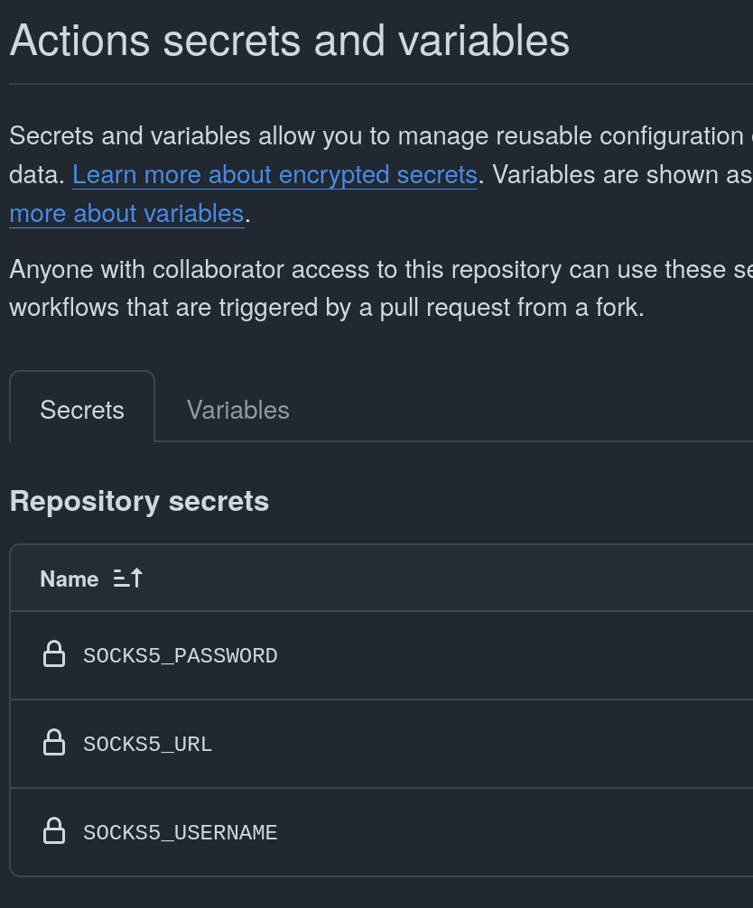

# Требования к hardware проекту

Документ описывает основные требования к hardware проекту, а также процедуру создания оного.

### 1. Разработка требований к электронному модулю

Любой проект начинается с технических требований, даже если они не зафиксированы. Для упрощения работы команды должен быть создан документ, описывающий основные технические требования устройства/модуля. Документ должен быть кратким, емким, не иметь разночтений, требования должны быть проверяемыми (иметь 2 значения: реализовано/НЕ реализовано). Документ поместить в каталог `docs/system_requirements.md`

### 2. Создание репозитория

Все проекты компании хранятся в git, это решает проблемы:

- Контроля версий

- Разграничения прав доступа

- Автоматизации процессов

Требования к репозиторию:

- Создается руководителем проекта!

- Название соответствует [стандарту](./general_naming_guid.md)

- Приватность (виден только участникам команды)

- Настроены `Collaborators`
  
  - Team: firmware; Role: read
  
  - Team: hardware; Role: write
  
  - Сторонние разработчики Role: triage/write

- Настроены `Features`: Issues, Projects, Actions, Secrets (см. [kici](https://github.com/MuratovAS/kici))

- Корректно заполнены `repository details`
  
  - Указано `Description`
  
  - Указаны `Topics`. Указывающие версии, например `kicad9`, `ki9ci3`
  
  - Включены `Releases`

- Все не используемые опции отключены, например `wiki`,`deployments`

### 3. Содержание репозитория

Требования:

- Структура соответствует [стандарту](./hardware_repository_structure.md)

- Проект `kicad` создан на основе [hardware-template](https://github.com/Artel-Inc/hardware-template)

- Содержит `pipeline` и настройки `cicd` из [kici](https://github.com/MuratovAS/kici)

- Содержит `docs/system_requirements.md` (из 1 пункта)

- Соответствует остальным рекомендациям из данного репозитория

### Настройки в картинках

