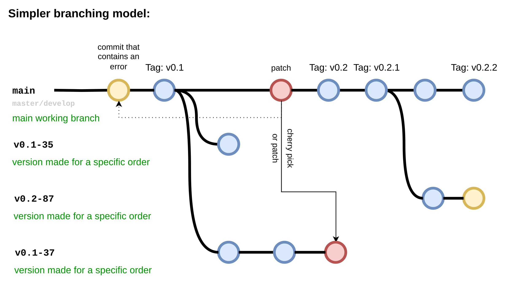

# Структура hardware репозитория

## Файловая структура

- README.md - Файл описания проекта
- calc - Директория с расчетами, математическими моделями
  - *.cir - Microcap схема
  - *.drawio - Drawio блок-схема
- docs - Директория с документацией
  - *.md/.odt/.pdf - Текстовые материалы
- hardware* - Директория проекта Kicad
  - localLib.pretty - Директория с локальными деталями (применимые только в этом проект) 
  - main.kicad_pro - Файл проекта
  - main.kicad_pcb - Файл печатной платы
  - *.kicad_sch - Файлы схем
  - main.kicad_dru - Файл с описанием требований производства
  - main.kicad_prl - Файл параметров отображения
- manufacturing - Директория с моделями корпусов, и прочими конструктивными элементами
- firmware (Optional) - Прошивка для MCU, храниться тут для небольших проектов (рекомендуется вынести в отдельный репозиторий)
- .github (Optional) - Конфигурация для Github
- .gitignore - Описание исключенных файлов из репозитория

## Содержание файла `README.md`

Этот файл отображается при просмотре репозитория

- `# XXX` - Шифр проекта, указывается в первой строке
- `Xxxx Xxxx Xxxx` - Расшифрованное название проекта, вторая строка
- `## Jumpers:` - Описание назначения перемычек
- `## Features:` - Обычно содержит таблицу с описанием разъемов подключения
- `## Changelog:` - Список изменений по версиям

### Пример `## Changelog:`

Обычно заполняется от более новой версии в более старой.

Версии формируются в формате `vX.X.X[-XXX]`. 
Где потеря совместимости платы вызывает инкремент левого числа.
Небольшие же изменения инкриминируют правую часть. (смотри [README](./version_guid.md)) 

```
## Changelog:

### v 0.2.0
- Added the ability to automatically mount xt60
- Changed sawing of the `F` connector
- Jumpers moved to the top layer
- Replacing `B` connector on XT60M

### v 0.1.0
- Init
```

## Пара слов о `.gitignore`

В репозитории должно храниться минимальное количество файлов.
Избегайте дублирования, хранения не используемых файлов.
В репозитории НЕ должны хранится:

- Временные файлы
- Резервные копии
- Генерируемые файлы
- Файлы от других проектов, если они не нужны для сборки текущего проекта

### Пример `.gitignore`

- `#General` - это комментарий
- `*.bak ` - Исключает все файлы с расширением .bak
- `hardware/jlcpcb/gerber` - Исключает каталог и файлы в нем
- `replicate_layout.log` - Исключает файл во всех директориях
- `*.kicad_pro` - Исключает все файлы проекта kicad
- `!main.kicad_pro` - Исключает из исключения файл main.kicad_pro (в конечном счете он будет сохранен)
  
  ```
  # General
  *.bak 
  hardware/jlcpcb/gerber
  replicate_layout.log
  *.kicad_pro
  !main.kicad_pro
  ```

## Структура ветвей `GIT`



- `main` - Основная рабочая ветвь (может иметь название master/develop)
- `vX.X.X-*` - Особая версия, измененная под конкретный заказ

### Ответы и вопросы по `git`:

`В`: Почему название рабочей ветви main а не develop?

`О`: Название main, имя по умолчанию. По своему предназначению это develop

`В`: Почему используются ветки по версиям, а не теги в main или стабильная ветвь?

`О`: Ветка для версии позволяет хранить уникальные исправления/изменения требующие фиксации. Далеко не всегда эти изменения будут применены к основной ветви.

`О`: Заказ PCB осуществляется из последней стабильной версии, промежуточные версии заказу не подлежать, т.к для них не формируется производственная документация.

`В`: Почему для работы всех разработчиков используется одна ветвь main?

`О`: Обычно ветвь main служит точкой объединения наработок из разных ветвей. Над hardware проектом обычно работает один человек, т.к объединение наработок затруднительно или невозможно. 
Одновременная работа должна происходит по договоренности, и чёткое разделение на файлы. Использование одной ветви исключает шанс потери наработок предыдущего разработчика, и исключает процесс "поиск нужной ветви, исключает коммит не в ту ветвь.....".

`В`: Могу ли я использовать собственную ветвь для реализации своей задачи?
`О`: Да, можно. Но это не исключает процесс согласования доступа на изменение файлов.
