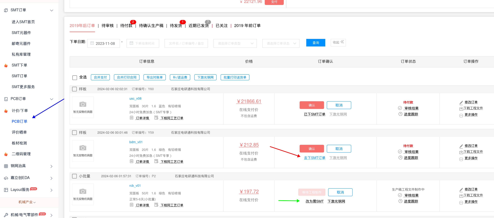
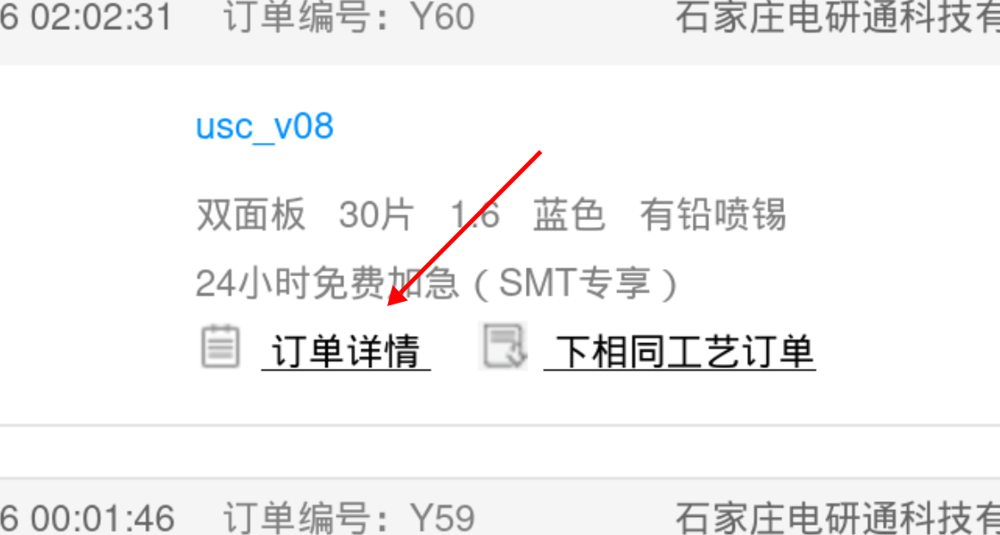

# Заказ pcb/smt на `jlc.com`

## Общие рекомендации

Заказ плат, кропотливых работ, ошибка на этом этапе может стоить достаточно дорого. Все ошибки придется исправлять собственными мощностями. 

Новые устройства должны проходить проверку на тестовой партии малого объема. 

Для заказа вам потребуется китайский/английский язык используйте `translate.yandex.com`, он может переводить со скриншота.

## Загрузка фотошаблонов

Все начинается с загрузки `gerber` файлов.
Перейдите в меню загрузки КД на печатную плату:

красный - меню загрузки файлов

зеленый - кнопка загрузки архива

Все начинается с загрузки `gerber` файлов. Готовый архив нужно скачать в репозитории в `Releases`.

> [!NOTE]
>
> Файл проекта должен называться по шаблону *_v??.zip
> Где `*` - трех буквенный шифр
> `v??` - версия проекта, без разделяющей точки.  Например, `rev 0.2` будет выглядеть как `v02`
>
> Файл используемый для заказа должен хранится в репозитории.

## Заказ PCB

Каждая плата имеет свои собственные требования, не отраженные в файле, их необходимо указывать в веб интерфейсе.

Для оформления требований к заказу на экране с предыдущего шага 

Обычно в каталоге `artel-inc/ПРОЕКТ/hardware/jlcpcb/` храниться изображение с типичными настройками для платы.
На скриншоте отмечены основные параметры необходимые для заказа

Если требуется сборка необходимо выбрать пункт с пометкой SMT

Что-то про доставку

В появившемся окне соглашаемся с условиями и создаем заказ

## Заказ SMT
Если на предыдущем этапе все верно выбрано, то в списке заказов появится плата с возможностью установки компонентов. 

Синяя стрелка - меню заказа

Красная стрелка - параметры сборки

Зеленая стрелка - плата без сборки

Нам нужно загрузить `CPL` и `BOM` для сборки. тыкаем по красной стрелке.

Обычно мы делаем односторонний (верхний) монтаж в Китае.  Для наших плат достаточно тарифа эконом. Но платы с увеличенной толщиной платы требуют стандартного тарифа сборки.

Что-то про доп опции (хз, не пользуемся):

Продолжаем заказ и оказываем в меню выбора деталей:

Зеленый прямоугольник - параметры из предыдущего окна, тут можно подправить, обычно дублируем те же параметры.

Синяя стрелка - указывает на деталь требующую замены (не достаточно деталей на складе). Замены делаются по согласования с разработчиками, в КД прописаны аналоги.

Затем приступаем к позиционированию деталей. Крутим, вертим что бы все детали стояли на положенных местах. При большом желании можно создать `issue` с перечнем деталей которые пришлось править, в некоторых случаях можно предусмотреть ориентацию на уровне КД.

Не устанавливаемые детали находятся в конце списка, необходимо подтвердить их отсутствие.

> [!WARNING]
> 
> Так же замечен случай когда сайт сам подменяет детали, не соответствующие КД.

> [!NOTE]
> 
> Не забывайте сохранять прогресс

Красные стрелки (на скрине выше) - необходимо проставить для всех деталей перед нажатием кнопки заказ.

Так же следует создать `issue`, с перечнем замен и списком не установленных деталей. В последствии эту информацию получить гораздо сложнее.

## Проверка/подтверждение заказа

Лучше что бы проверку заказа делал другой человек или же на следующий день после формирования заказа. 

Необходимо проверить:

- Перечень плат
- Количество плат
- Визуальный осмотр (все ли устанавливаемо, ориентация деталей)
- По возможности технические характеристики
- Статус возможности сборки

Статус возможности сборки смотреть тут:

красная стрелка - SMT утвержден

Синея стрелка - SMT требует правки

Технические детали заказа смотреть тут:

