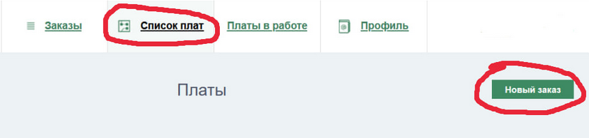
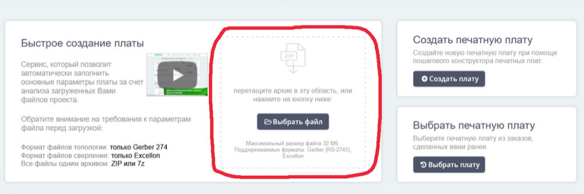
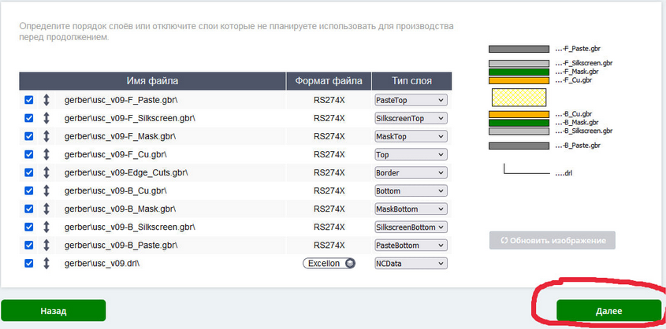
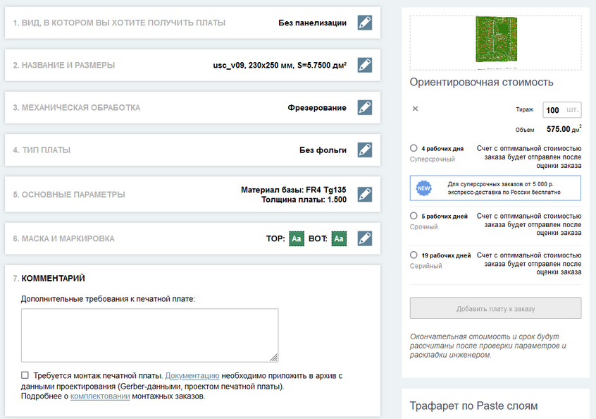
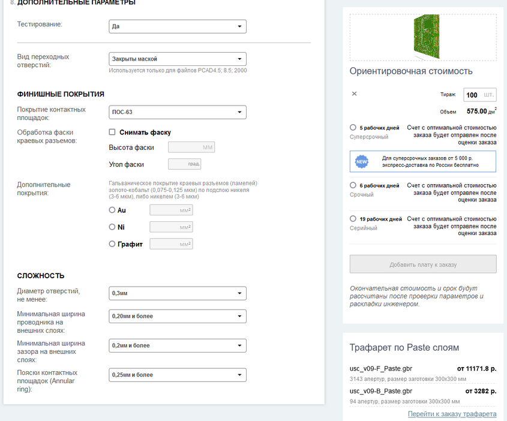
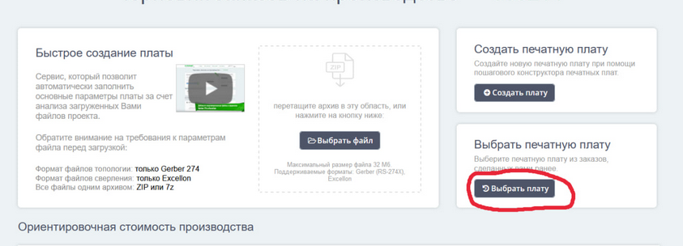
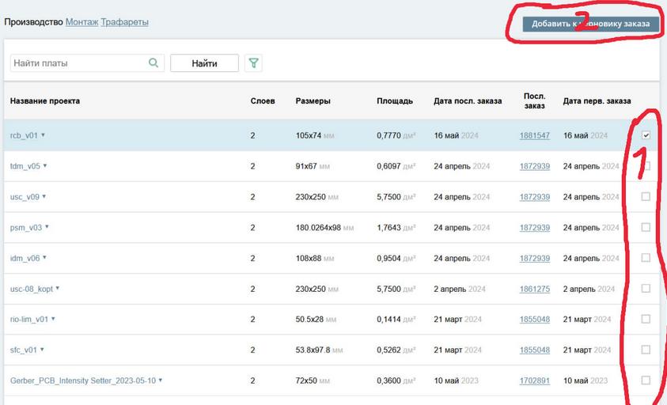
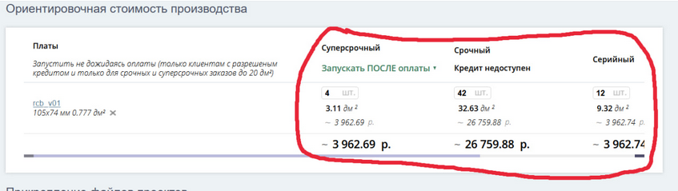
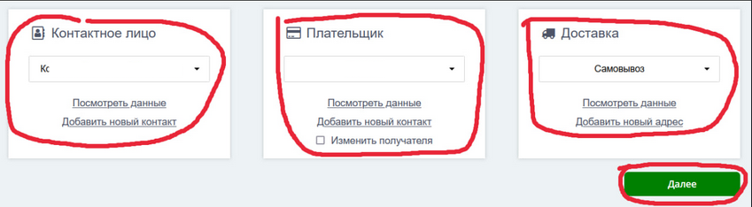
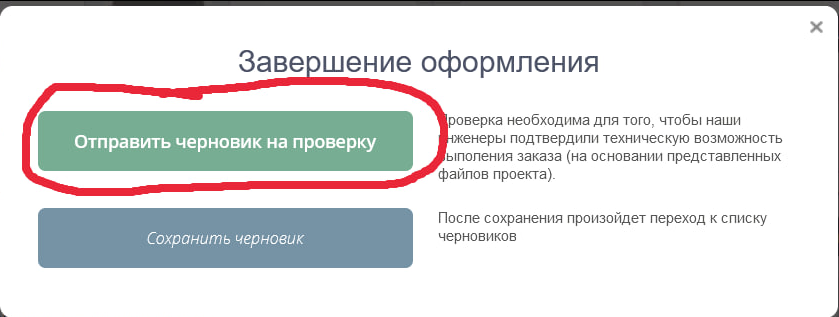

# Заказ pcb на `rezonit.ru`

## Общие рекомендации

* Заказ плат - кропотливая работа, ошибка на этом этапе может стоить достаточно дорого. Все ошибки придется исправлять собственными мощностями. 
* Новые устройства должны проходить проверку на тестовой партии малого объема.
* При повторном заказе той же ревизии платы не обязательно заново загружать `gerber` файлы. Можно сразу начать с [заказа pcb](#заказ-pcb "Да, да, жми сюда").

## Загрузка фотошаблонов

> [!TIP]
> Перед загрузкой gerber файлов проверь, возможно плата этой версии уже была загружена в личный кабинет.
> Нужно проверить правильно ли выбраны параметры у существующей платы.
> Если это так, то монжо сделать [повторный заказ](#повторный_заказ_pcb "повторный заказ pcb")

Все начинается с загрузки `gerber` файлов. Готовый архив нужно скачать в репозитории в `Releases`.

> [!NOTE]
> 

> 
Расшифровка названия проекта

> Файл проекта должен называться по шаблону *_v??.zip
> Где `*` - трех буквенный шифр проекта
> `v??` - версия (ревизия) проекта, без разделяющей точки.  Например, `rev 0.2` будет выглядеть как `v02`
>Файл используемый для заказа должен хранится в репозитории.
> 

> [!WARNING]
>  
> Если в архиве есть файлы *_v??-drl_map.gbr и/или *_v??-job.gbrjob , то их нужно удалить.
> Резонит не будет работать с таким архивом корректно.
>
> 

> 
Пример

>
>   
> 
> 

Нужно открыть раздел `список плат` > `новая плата`

Загрузите архив тут

На следующем этапе нужно включить все слои, выбрать тип слоя и расположить слои так, как они будут распологаться в плате.

> [!NOTE]
> 

> 
Расшифровка названии файлов слоев

> Тип слоя, который нужно выбрать указан после ревизии платы в формате *_v??-A_BBB.gbr, кроме слоя NCData и Border. 
> NCData слой имеет формат *_v??.drl, Border - *_v??-Edge_Cuts.gbr.
> 
> Где:
> 
> `*` - трех буквенный шифр проекта
> 
> `v??` - версия (ревизия) проекта
> 
> `A` - сторона, F - Top, B - Bottom
> 
> `BBB` - тип слоя. Слой Cu обозначается резонитом без типа слоя, как просто Top или Bottom
> 
> Нужно выбрать правильный тип слоя, например:
> 
> foo_v42-F_Paste.gbr - PasteTop
> 
> bar_v23-Edge_Cuts.gbr - Border
> 
> baz_v69-B_Cu - Bottom
> 

Сравните то, что у вас получилось с примером и жмите далее. Количество слоев может отличаться в зависимости от платы.

## Заказ PCB

Все настройки можно взять из `artel-inc/НАЗВАНИЕ_ПРОЕКТА/hardware/jlcpcb/`.
Там лежат настройки для JLCPCB, можно взять все настройки оттуда, кроме некоторых.
В резоните нужно доплачивать и дольше ждать за любую маску, кроме зеленой с белой шелкографией, по этому выбираем зеленую маску и белую шелкографию.
Панелизацию и разделение нужно согласовать с производством, которое делает монтаж. Размеры платы нормально определяются автоматически.
Срок выбрать в зависимости от текущей ситуации. Количество лучше указывать здесь же.

Должно получиться примерно так:

Далее выбираем срок и жмем `Добавить плату к заказу`

К заказу можно добавить несколько видов плат с разными сроками.
Производство трафаретов и монтажа заказывается отдельным заказом от заказа плат.

## Повторный заказ PCB

Повторный заказ PCB

Если плата уже была загружена в резонит заранее, то можно выбрать ее в меню плат и добавить к существующему заказу

Вводим необходимое количество плат и переходим к другому этапу

## Проверка/подтверждение заказа

Лучше что бы проверку заказа делал другой человек или же на следующий день после формирования заказа. 

Необходимо проверить:

- Перечень плат
- Количество плат
- Визуальный осмотр плат в предпросмотре (могут быть некоторые проблемы с предварительным просмотром, при возникновении нужно уточнить у менеджера дефект это предпросмотра или обработки платы)
- Версии/ревизии плат

Выберите контактное лицо, плательщика и доставку/самовывоз. Как показывает практика, самовывоз из офиса в г. Екатеринбург удобнее всего.

Через 1-2 рабочих дня черновик проверят и можно будет запускать платы в производство с предварительной оплатой.

> [!IMPORTANT]  
> Важно: Платы запустят в производство только после получения оплаты.

