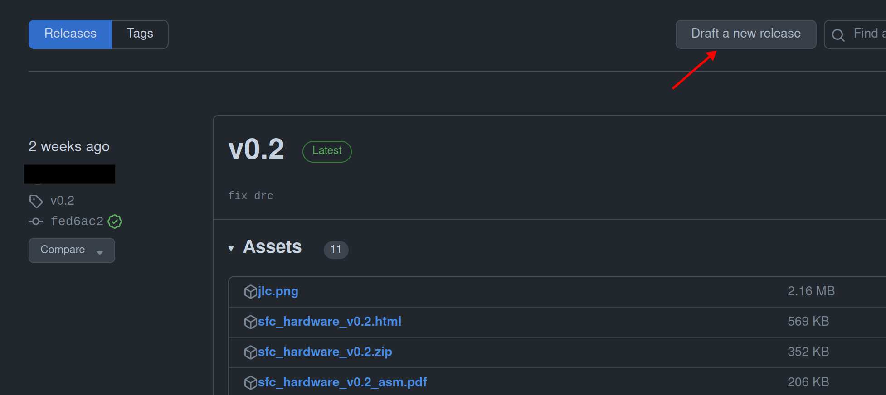

# Процедура пред/пост-заказ печатных плат.

На сегодняшний день процедура подготовки КД на печатную плату и списков закупки (extended bom + bom) автоматизирована. 

## Где взять КД?

1. Необходимо определиться, какую плату и какую версию необходимо изготовить и на каком производстве.
   Предположим нам необходима плата `sfc` последней версии. 

2. Ищем соответствующую плату в репозиториях организации
   
   

3. Необходимо проверить версию, велика вероятность, что кд на последнюю версию не сформировано.
   

4. Смотрим внимательно на страницу, если есть отклонения уведомляем Maintainer (руководителем).
   
   1. Если есть открытые `PR` (зеленая стрелка)
   2. Если версия (красная стрелка) в `Changelog` не соответствует `Releases`
   3. Если `Releases` сформирован не из последнего коммита (синяя стрелка)

5. Берем полученные файлы и переходим к инструкции по заказу на конкретном производстве (смотри [README](./README.md)).

## Как самостоятельно выпустить КД?

> [!WARNING]
> 
> Перед началом выпуска КД необходимо закрыть все `PR` и проверить `issues` на наличие критических проблем. Согласовать их устранение с Maintainer.

> [!NOTE]
> 
> Убедитесь что `Releases`, создается из платы прошедшей тестирование `ERC/DRC`
> 
> 

1. Ознакомиться с принципом формирования версий (смотри [README](./version_guid.md)).

2. Перейти в `Releases` и воспользоваться  `Draft a new release`.
   

3. Создайте `Tag`.
   

4. Создайте `Release notes`.
   
   

5. Создайте релиз.
   

6. Дождаться формирования КД. Процесс можно отслеживать в `Action`

7. После успешного завершения. В файлах релиза появятся КД.
   

## Как проверить наличие деталей до заказа платы?

Для этого есть специальный `action`, он запускается автоматически при создание релиза, но так же может быть запущен вручную.

1. Перейдите в репозиторий интересующей вас платы.

2. Зайдите в `Actions`.
   

3. Перейдите в `Kicad Stock`, нажмите `Run workflow`.
   
   

4. Выберете тег или ветку для которой необходимо построить `bom`. обычно подходит ветка `main`.
   

5. После этого начнется выполнение действия, дождитесь окончания (5-15 мин).
   
   Вы можете посмотреть результат в `log`(зеленая стрелка) или `artifact`(красная стрелка)
   

6. Немного о столбцах таблицы
   
   - `lcsc` ,`*_sku`..... - артикул поставщика (`*_sku` полученный от поставщика)
   
   - `pn` или `*_mpn` - артикул производителя (`*_mpn` полученный от поставщика)
   
   - `*_ok` или `*_consistent` - поле имеет булево значение,  если `sku` и `pn` соответствуют значениям kicad. 
   
   - `*_enough` - `*_stock` > `qty_total`, деталей достаточно для сборки заказа

## Как сделать отчет по заказу плат?

В процессе заказа плат будут замены деталей или детали которые не сможет установить производитель, эта информация требует декларации.

Существует форма+автоматизация позволяющая хранить информацию о заказе.

1. Перейдите в репозиторий интересующего проекта.

2. Создайте `issue`.
   

3. Выберете "отчет о заказе".
   

4. Заполните форму. в соответствии с рекомендациями. 
   

5. После создания`issue`. Дождитесь завершения `Action`, после вы получить уведомления с сопутствующими документами.
   

6. Уведомите руководителя о завершении заказа и уведомите закупщика о необходимости покупке деталей.

## Рекомендации по заполнению формы

> [!WARNING]
> 
> Будьте осторожны с параметром (5) указывающим на автоматическое формирования списка деталей отсутствующих на складе. При использование проверяйте файл. Лучше прописывать `designators` вручную

1. Укажите идентификатор заказа.
   Обычно он формируется из ПРОИЗВОДИТЕЛЬ-ДАТА. 
   
   - Поле не используется в автоматизации (пока что)
   
   - Стоит от метить что JLC и JLCPCB это разные производители
   
   - Укажите дату создания заказа

2- Укажите версию КД.
   
   - Версия должна строго соответствовать тегу в `git`. После заполнение происходит клонирование оной.
   
   - Пробелы в начале и конце строки будут удалены.

3- Укажите директорию в которой находится проект kicad.
   
   - Используется в автоматизации, неверное значения привет к ошибке.
   
   - Чувствительно к регистру.
   
   - Пробелы в начале и конце строки будут удалены.
   
   - Поле необходимо, т.к в одном репозиторие может быть несколько Kicad проектов. 
   
   - В случае заказа нескольких разных плат из одного репозитория, следует создать на каждую отчет о заказе.

4- Выберете тип монтажа ПП.
   
   - Если производитель ПП не осуществляет монтаж, укажите `no`.
   
   - Поле необходимо для формирования перечня на докупку (extended bom) элементов.
   
   - Оно позволяет не прописывать вручную элементы для докупки в `List designators for extended bom`. То есть, если вы указали `top`, элементы с слоя `bottom` будут автоматически добавлены в `extended bom`.

5- Следует ли добавлять отсутствующие элементы на jlc в `extended bom`.
   
   - Система автоматически проверяет наличие деталей на jlc, если известно что их нет, на плату они не будут установлены и требуют докупки. 
   
   - Если выбрано `no`, для всех деталей отсутствующих на складах jlc следует вручную прописать `designators` в соответствующем поле.

6- Количество собранных/требующих сборки плат в заказе.
   
   - Укажите число, оно будет использовано для подсчета деталей в `extended bom`.

7. Укажите `extended bom`.деталей которые должны попасть в `extended bom`.
   
   - Используется в автоматизации
   
   - Поле игнорирует, пробелы, переходы на новые строки, регистр текста
   
   - В качестве разделителя используется строго запятая `,`
   
   - Могут использоваться диапазоны `C10-C20`
   
   - Не следуют вручную прописывать сюда детали, находящиеся с обратной стороны платы, если указано что сборка будет осуществлена на `top`

8.  Можете записать свои наблюдения, измененные детали, проблемы с компонентами. 

> [!NOTE]
> 
> В `extended bom` попадают только те компоненты:
> 
> - Находящиеся на стороне платы для которых не заказана сборка
> 
> - Компоненты отсутствующие на складах jlc (опционально)
> 
> - Компоненты для которых прописаны `designators` (опционально)
