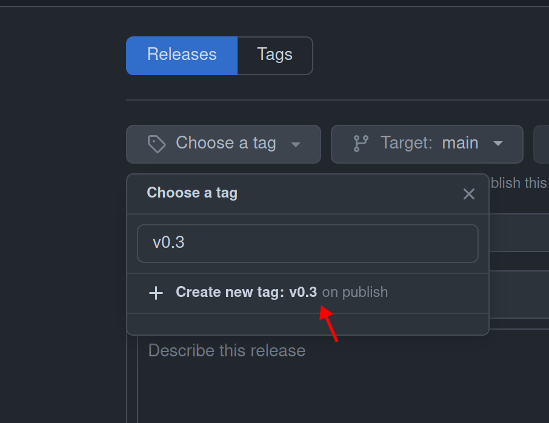
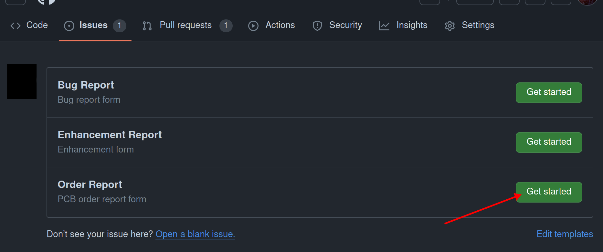
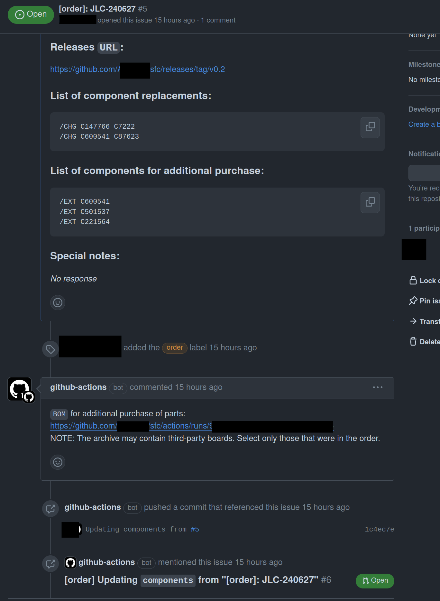

# Процедура пред/пост-заказ печатных плат.

На сегодняшний день процедура подготовки КД на печатную плату автоматизирована. Так же частично автоматизирована процедура формирования документ досборки. 

## Где взять КД?

1. Необходимо определиться, какую плату и какую версию необходимо изготовить и на каком производстве.
   Предположим нам необходима плата `sfc` последней версии. 

2. Ищем соответствующую плату в репозиториях организации.

   

3. Необходимо проверить версию, велика вероятность, что кд на последнюю версию не сформировано.
   

4. Смотрим внимательно на страницу, если есть отклонения уведомляем Maintainer (руководителем).
   1. Если есть открытые `PR` (зеленая стрелка)
   2. Если версия (красная стрелка) в `Changelog` не соответствует `Releases` (важны только первые 2 цифры разделенные точкой)
   3. Если `Releases` сформирован не из последнего коммита (синяя стрелка). 

5. Берем полученные файлы и переходим к инструкции по заказу на конкретном производстве. (смотри [README](./README.md))

## Как самостоятельно выпустить КД?

> [!WARNING]
>
> Перед началом выпуска КД необходимо закрыть все `PR` и проверить `issues` на наличие критических проблем. Согласовать их устранение с Maintainer.

> [!NOTE]
>
> Убедитесь что `Releases`, создается из платы прошедшей тестирование `ERC/DRC`
>
> 

1. Понять принцип формирования версий (смотри [README](./version_guid.md))
2. Перейти в `Releases` и воспользоваться  `Draft a new release`.
   
3. Создать `tag`, указать `title` они должны совпадать.
   

4. Создать релиз. По необходимости можно сделать описание релиза. 
   
5. Дождаться формирования КД. Процесс можно отслеживать в `Action`

6. После успешного завершения. В файлах релиза появятся файлы.
   

## Как сделать отчет по заказу плат?

В процессе заказа плат будут замены деталей или детали которые не сможет установить производитель, эта информация требует декларации.

Существует форма+автоматизация позволяющая хранить информацию о заказе.

1. Перейдите в репозиторий заказываемой платы.
2. Создайте `issue`.
   

3. Выберете "отчет о заказе".
   

4. Следуйте форме.
   

5. После создания`issue`. Дождитесь завершения `action` (смотри: "Как самостоятельно выпустить КД?"). Вы должны получить уведомления с сопутствующими документами и правками в проект.
   
6. Уведомите руководителя о завершении заказа и уведомите закупщика о необходимости покупке деталей.
