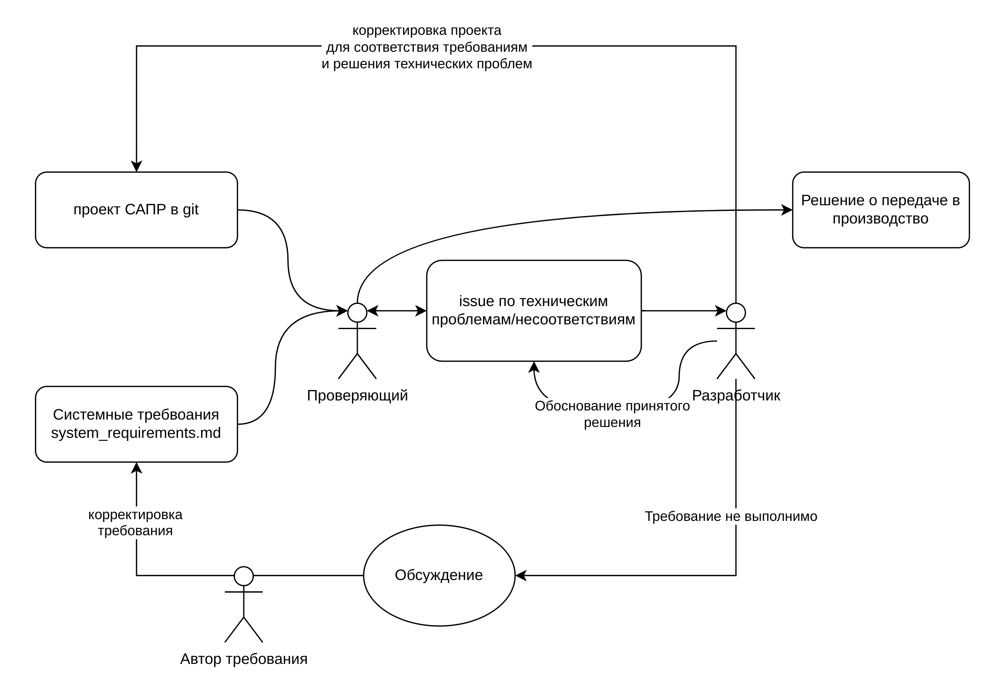

# Процедура верификации hardware дизайна

### Цель процедуры

Провести проверку дизайна:

- на соответсвие требованиям
- на наличие технических проблем или сомнений верификатора относительно представленного дизайна, которые могут помешать нормальному функционированию, эксплуатации или производству продукции.

Дизайн представляется собой проект в САПР, содержащий в себе исчераывающую информацию о конструкции, ее компонентах, взаимосвязях, модулях и т.д.

### Входные данные процедуры

- Системные требования, расположенные в /docs/system_requirements.md или согласно плану проекта
- Проект электронного модуля, расположенный в системе контроля версий(git)
- Issue созданный в рамках системы управления проекта

### Алгоритм верификации

### Форма спецификации требований

| ID                             | Requirement                    | Implementation (yes/no/partly) | comment                                                                   |
| ------------------------------ | ------------------------------ | ------------------------------ | ------------------------------------------------------------------------- |
| уникальный идентификатор       | текст требования               | статус реализации требования   | коментарий поясняющий суть в чем несоотвествие или частичное соответствие |
| заполняется автором требования | заполняется автором требования | заполняется проверяющим        | заполняется проверяющим                                                   |
